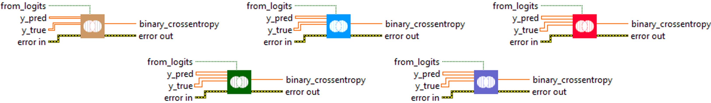
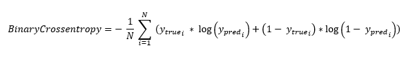
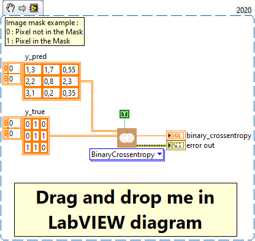
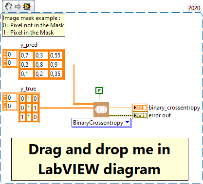

<h1>BinaryCrossentropy</h1>

<h2>Description</h2>

Computes the crossentropy metric between the labels and predictions. Type : <em><strong>polymorphic</strong><strong>.</strong></em>

<h3>Input parameters</h3>

<table>
  <tbody>
    <tr>
      <td width="64" valign="top"></td>
      <td valign="top"><strong>y_pred : <em>array, </em></strong>predicted values (if from_logits = true then y_pred is logits data else is probabilities between 0 and 1).</td>
    </tr>
    <tr>
      <td width="64" valign="top"></td>
      <td valign="top"><strong>y_true : <em>array, </em></strong>true values (binary numerical label [ 0 ], [ 1 ]).</td>
    </tr>
    <tr>
      <td width="64" valign="top"></td>
      <td valign="top"><strong> from_logits : <em>boolean,</em></strong> whether output is expected to be a logits tensor.</td>
    </tr>
  </tbody>
</table>

<h3>Output parameters</h3>

<table>
  <tbody>
    <tr>
      <td width="64" valign="top"></td>
      <td valign="top"><strong>binary_crossentropy : <em>float, </em></strong>result.</td>
    </tr>
  </tbody>
</table>

<h2>Use cases</h2>

The binary crossentropy metric is a loss function used in machine learning, particularly in binary classification problems. Cross entropy measures the performance of a classification model whose outputs are probabilities between 0 and 1.

It is commonly used in many fields, including :

<ul>
<li>
<ul>
<li>Recommendation systems : to predict whether a user will like a product or not.</li>
<li>Fraud detection : to predict whether a transaction is fraudulent or not.</li>
<li>Medicine : to predict whether a patient has a disease or not.</li>
</ul>
</li>
</ul>

<h2>Calculation</h2>

This is the crossentropy metric class to be used when there are only two label classes (0 and 1).

<h2>Example</h2>

All these exemples are snippets PNG, you can drop these Snippet onto the block diagram and get the depicted code added to your VI (Do not forget to install Deep Learning library to run it).

<h3>Easy to use from logits</h3>

<h3>Easy to use from probalities</h3>

