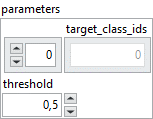
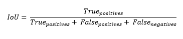

<h1>BinaryIoU</h1>

<h2>Description</h2>

Computes the Intersection-Over-Union metric for class 0 and/or 1. Type : <em><strong>polymorphic</strong><strong>.</strong></em>

<h3>Input parameters</h3>

<table>
  <tbody>
    <tr>
      <td width="64" valign="top"></td>
      <td valign="top"><strong>y_pred : <em>array, </em></strong>predicted values (logits values).</td>
    </tr>
    <tr>
      <td width="64" valign="top"></td>
      <td valign="top"><strong>y_true : <em>array, </em></strong>true values (logits values, or binary values if the threshold value is between 0 and 1).</td>
    </tr>
  </tbody>
</table>

<table>
  <tbody>
    <tr>
      <td valign="top" width="70%"><table>
  <tbody>
    <tr>
      <td width="64" valign="top"></td>
      <td valign="top"><strong> parameters : <em>cluster,</em></strong></td>
    </tr>
    <tr>
      <td></td>
      <td valign="top"><table>
  <tbody>
    <tr>
      <td width="64" valign="top"></td>
      <td valign="top"><strong>target_class_ids : <em>array,</em></strong> list of target class ids for which the metric is returned.</td>
    </tr>
    <tr>
      <td width="64" valign="top"></td>
      <td valign="top"><strong> threshold : <em>float,</em></strong> representing the threshold for deciding whether prediction and true values are 1 or 0 (above the threshold is true, below is false).</td>
    </tr>
  </tbody>
</table></td>
    </tr>
  </tbody>
</table></td>
      <td valign="top" width="30%">

</td>
    </tr>
  </tbody>
</table>

<h3>Output parameters</h3>

<table>
  <tbody>
    <tr>
      <td width="64" valign="top"></td>
      <td valign="top"><strong>binary_iou : <em>float, </em></strong>result.</td>
    </tr>
  </tbody>
</table>

<h2>Use cases</h2>

Intersection Over Union (IOU) is a commonly used metric in computer vision, particularly for evaluating object detection and image segmentation performance.

The binary version of this metric, binary IOU, would be specifically used in binary image segmentation problems, where each pixel of the image is classified as belonging to the object of interest (class 1) or to the background (class 0). In this context, IOU measures the degree of overlap between the region predicted by the model as belonging to the object and the true object region in the image.

Consequently, binary IOU would be used in fields such as object detection, image recognition, autonomous driving, remote sensing, among others, where precise image segmentation is crucial.

<h2>Calculation</h2>

This class can be used to compute IoUs for a binary classification task where the predictions are provided as logits and true values as logits (or binary values if the threshold value is between 0 and 1). First a threshold is applied to the predicted and true values such that those that are below the threshold are converted to class 0 and those that are above the threshold are converted to class 1.

IoUs for classes 0 and 1 are then computed, the mean of IoUs for the classes that are specified by <em><strong>“target_class_ids” </strong></em>is returned.

<table>
  <tbody>
    <tr>
      <td valign="top" width="62%">

</td>
      <td valign="top" width="38%">

</td>
    </tr>
  </tbody>
</table>

<h2>Example</h2>

All these exemples are snippets PNG, you can drop these Snippet onto the block diagram and get the depicted code added to your VI (Do not forget to install Deep Learning library to run it).

<h3>Easy to use</h3>

