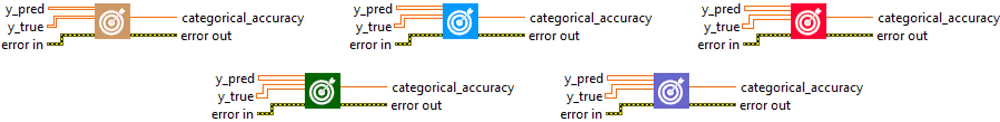
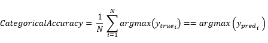

<h1>CategoricalAccuracy</h1>

<h2>Description</h2>

Calculates how often predictions match one-hot labels. Type : <em><strong>polymorphic</strong><strong>.</strong></em>

<h3>Input parameters</h3>

<table>
  <tbody>
    <tr>
      <td width="64" valign="top"></td>
      <td valign="top"><strong>y_pred : <em>array, </em></strong>predicted values (one hot logits for example, [0.1, 0.8, 0.9] or one hot probabilities for example, [0.1, 0.3, 0.6] for 3-class problem).</td>
    </tr>
    <tr>
      <td width="64" valign="top"></td>
      <td valign="top"><strong>y_true : <em>array, </em></strong>true values (one hot encoding for example, [0, 0, 1] for 3-class problem).</td>
    </tr>
  </tbody>
</table>

<h3>Output parameters</h3>

<table>
  <tbody>
    <tr>
      <td width="64" valign="top"></td>
      <td valign="top"><strong>categorical_accuracy : <em>float, </em></strong>result.</td>
    </tr>
  </tbody>
</table>

<h2>Use cases</h2>

The categorical accuracy metric is used in multiclass classification problems in machine learning. In a multiclass classification problem, an output variable can have more than two possible states. For example, a machine learning algorithm could be trained to predict different species of animal, different types of car, different genres of film, and so on.

It is very useful for evaluating models in areas such as :

<ul>
<li>
<ul>
<li>Image recognition : for example, classifying clothing images into different categories (pants, dresses, shoes, etc.).</li>
<li>Natural language processing : for example, classifying text documents into different categories (news, sports, politics, etc.).</li>
<li>Medicine : for example, classifying medical tissue samples into different disease categories.</li>
</ul>
</li>
</ul>

<h2>Calculation</h2>

Before calculating this metric, argmax is always applied to y_pred and y_true on the last axis in order to determine the integer label. Then computes the frequency with which y_pred matches y_true. This frequency is ultimately returned as binary accuracy : an idempotent operation that simply divides total by count.

y_pred and y_true should be passed in as vectors of probabilities, rather than as labels.

<h2>Example</h2>

All these exemples are snippets PNG, you can drop these Snippet onto the block diagram and get the depicted code added to your VI (Do not forget to install Deep Learning library to run it).

<h3>Easy to use</h3>

