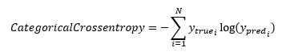
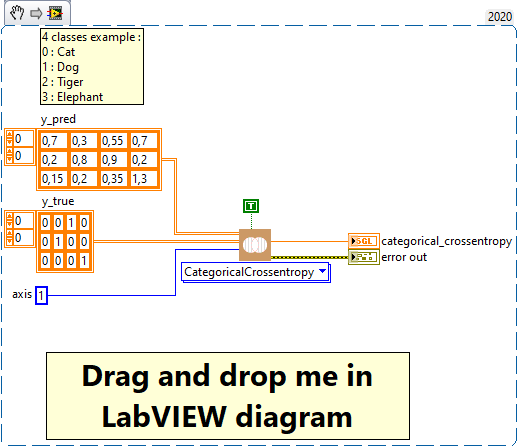
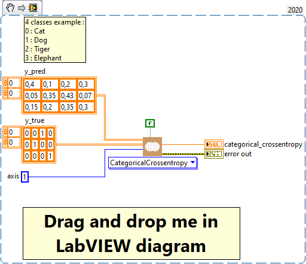

<h1>CategoricalCrossentropy</h1>

<h2>Description</h2>

Computes the crossentropy metric between the labels and predictions. Type : <em><strong>polymorphic</strong><strong>.</strong></em>

<h3>Input parameters</h3>

<table>
  <tbody>
    <tr>
      <td width="64" valign="top"></td>
      <td valign="top"><strong>y_pred : <em>array, </em></strong>predicted values (if from_logits = true then one hot logits for example, [0.1, 0.8, 0.9] else one hot probabilities for example, [0.1, 0.3, 0.6] for 3-class problem).</td>
    </tr>
    <tr>
      <td width="64" valign="top"></td>
      <td valign="top"><strong>y_true : <em>array, </em></strong>true values (one hot for example, [0, 0, 1] for 3-class problem).</td>
    </tr>
    <tr>
      <td width="64" valign="top"></td>
      <td valign="top"><strong> from_logits : <em>boolean,</em></strong> whether y_pred is expected to be a logits tensor.</td>
    </tr>
    <tr>
      <td width="64" valign="top"></td>
      <td valign="top"><strong>axis : <em>integer,</em></strong> the dimension along which entropy is computed.</td>
    </tr>
  </tbody>
</table>

<h3>Output parameters</h3>

<table>
  <tbody>
    <tr>
      <td width="64" valign="top"></td>
      <td valign="top"><strong>categorical_crossentropy : <em>float, </em></strong>result.</td>
    </tr>
  </tbody>
</table>

<h2>Use cases</h2>

The categorical crossentropy metric, is a loss function used for multiclass classification problems in machine learning. It is specifically used for multiclass classification problems, where a target variable can take on more than two values. For example, it could be used to train a model to classify animal images into different categories (cat, dog, horse, etc.) or to classify text documents into different genres (fiction, non-fiction, poetry, etc.).

<h2>Calculation</h2>

This is the crossentropy metric class to be used when there are multiple label classes (2 or more). It measures the performance of a classification model whose output is a probability between 0 and 1. 

<h2>Example</h2>

All these exemples are snippets PNG, you can drop these Snippet onto the block diagram and get the depicted code added to your VI (Do not forget to install Deep Learning library to run it).

<h3>Easy to use from logits</h3>

<h3>Easy to use from probabilities</h3>

