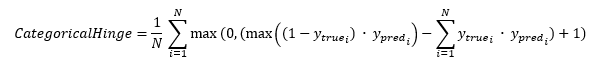

<h1>CategoricalHinge</h1>

<h2>Description</h2>

Computes the categorical hinge metric between y_true and y_pred. Type : <em><strong>polymorphic</strong><strong>.</strong></em>

<h3>Input parameters</h3>

<table>
  <tbody>
    <tr>
      <td width="64" valign="top"></td>
      <td valign="top"><strong>y_pred : <em>array, </em></strong>predicted values (one hot probabilities for example, [0.1, 0.3, 0.6] for 3-class problem).</td>
    </tr>
    <tr>
      <td width="64" valign="top"></td>
      <td valign="top"><strong>y_true : <em>array, </em></strong>true values (one hot for example, [0, 0, 1] for 3-class problem).</td>
    </tr>
  </tbody>
</table>

<h3>Output parameters</h3>

<table>
  <tbody>
    <tr>
      <td width="64" valign="top"></td>
      <td valign="top"><strong>categorical_hinge : <em>float, </em></strong>result.</td>
    </tr>
  </tbody>
</table>

<h2>Use cases</h2>

The categorical hinge metric, also known as categorical margin loss, is a loss function used in machine learning for multiclass classification problems. For example, it could be used to train a model to classify images into different categories (such as different types of clothing) or to classify text documents into different genres. This metric is often used in the fields of computer vision and natural language processing, but can be applied to any multiclass classification task.

<h2>Calculation</h2>

The function calculates the difference between the true class and the predicted value, then takes the maximum between this difference and 0.

If the prediction is correct (if y_pred is equal to y_true), then the loss value is 0. If the prediction is incorrect, the loss value is the difference between the true class and the prediction.

<h2>Example</h2>

All these exemples are snippets PNG, you can drop these Snippet onto the block diagram and get the depicted code added to your VI (Do not forget to install Deep Learning library to run it).

<h3>Easy to use</h3>

