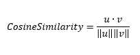

<h1>CosineSimilarity</h1>

<h2>Description</h2>

Computes the cosine similarity between the labels and predictions. Type : <em><strong>polymorphic</strong><strong>.</strong></em>

<h3>Input parameters</h3>

<table>
  <tbody>
    <tr>
      <td width="64" valign="top"></td>
      <td valign="top"><strong>y_pred : <em>array, </em></strong>predicted values.</td>
    </tr>
    <tr>
      <td width="64" valign="top"></td>
      <td valign="top"><strong>y_true : <em>array, </em></strong>true values.</td>
    </tr>
  </tbody>
</table>

<h3>Output parameters</h3>

<table>
  <tbody>
    <tr>
      <td width="64" valign="top"></td>
      <td valign="top"><strong>cosine_similarity : <em>float, </em></strong>result.</td>
    </tr>
  </tbody>
</table>

<h2>Use cases</h2>

The cosine similarity measure is commonly used in automatic natural language processing (NLP), text analysis, system recommendation and bioinformatics.

Here are a few specific areas of application:

<ul>
<li>
<ul>
<li>In natural language processing (NLP) : cosine similarity is often used to compare the similarity between two documents or two words. For example, it can be used to measure the similarity between two sentences, or to find the most similar words to a given word in a vector space.</li>
<li>In recommendation systems : cosine similarity can be used to recommend similar products to a user based on their past preferences. For example, if a user has enjoyed certain films, you can recommend other similar films by calculating the cosine similarity between the vectors representing the films.</li>
<li>Bioinformatics : cosine similarity can be used to compare DNA or protein sequences.</li>
</ul>
</li>
</ul>

It should be noted that while cosine similarity is a useful measure in many cases, it may not be appropriate in all scenarios, particularly where the absolute “distance” between vectors is large.

<h2>Calculation</h2>

Cosine similarity is a measure used to determine the degree of similarity between two vectors. It stores the average cosine similarity between predictions and labels in a data.

Cosine similarity gives a value between -1 and 1. A value of 1 means that the two vectors have the same orientation (are perfectly aligned), a value of -1 means that they have opposite orientations, and a value of 0 means that the vectors are orthogonal (perpendicular to each other). It is important to note that cosine similarity only takes into account the orientation of the vectors, not their length.

<h2>Example</h2>

All these exemples are snippets PNG, you can drop these Snippet onto the block diagram and get the depicted code added to your VI (Do not forget to install Deep Learning library to run it).

<h3>Easy to use</h3>

