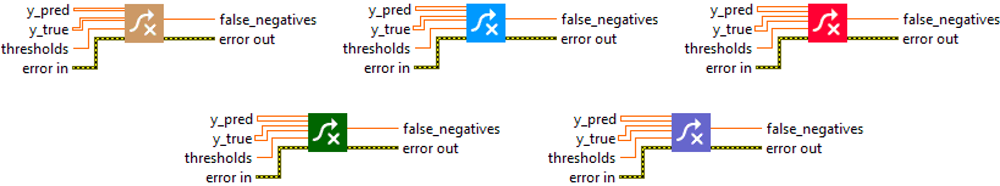
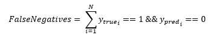

<h1>FalseNegatives</h1>

<h2>Description</h2>

Calculates the number of false negatives. Type : <em><strong>polymorphic</strong><strong>.</strong></em>

<h3>Input parameters</h3>

<table>
  <tbody>
    <tr>
      <td width="64" valign="top"></td>
      <td valign="top"><strong>y_pred : <em>array, </em></strong>predicted values (logits values).</td>
    </tr>
    <tr>
      <td width="64" valign="top"></td>
      <td valign="top"><strong>y_true : <em>array, </em></strong>true values (logits values, or binary values if the threshold value is between 0 and 1).</td>
    </tr>
    <tr>
      <td width="64" valign="top"></td>
      <td valign="top"><strong> thresholds : <em>float,</em></strong> representing the threshold for deciding whether prediction and true values are 1 or 0 (above the threshold is true, below is false).</td>
    </tr>
  </tbody>
</table>

<h3>Output parameters</h3>

<table>
  <tbody>
    <tr>
      <td width="64" valign="top"></td>
      <td valign="top"><strong>false_negatives : <em>float, </em></strong>result.</td>
    </tr>
  </tbody>
</table>

<h2>Use cases</h2>

The false negatives metric is used in machine learning classification problems. A false negative occurs when the model incorrectly predicts the negative class for an observation that is actually positive. This metric is particularly important in areas where the consequences of an incorrect negative prediction (a false negative) are severe.

Here are a few examples :

<ul>
<li>
<ul>
<li>In medicine : when diagnosing diseases, a false negative means that a sick person is incorrectly identified as being in good health. This can lead to a delay in treatment and potentially serious consequences for the patient.</li>
<li>In safety or quality testing : for example, if a model is used to detect defects in manufacturing parts, a false negative means that a defective part is incorrectly identified as defect-free. this can lead to defective products being shipped to customers.</li>
<li>In spam detection : A false negative means that a spam message is incorrectly identified as legitimate. This can result in unwanted messages being delivered to a user’s inbox.</li>
</ul>
</li>
</ul>

<h2>Calculation</h2>

The “False Negatives” metric is used in the context of binary classification, where the possible outcomes are “Positive” (represented by 1) and “Negative” (represented by 0).

A “False Negative” (FN) occurs when a model incorrectly predicts the negative class for an example that is actually of the positive class. In other words, the model predicted that the event would not occur, but it actually did.

<table>
  <tbody>
    <tr>
      <td valign="top" width="62%">

</td>
      <td valign="top" width="38%">

</td>
    </tr>
  </tbody>
</table>

<h2>Example</h2>

All these exemples are snippets PNG, you can drop these Snippet onto the block diagram and get the depicted code added to your VI (Do not forget to install Deep Learning library to run it).

<h3>Easy to use</h3>

