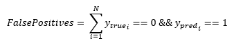

<h1>FalsePositives</h1>

<h2>Description</h2>

Calculates the number of false positives. Type : <em><strong>polymorphic</strong><strong>.</strong></em>

<h3>Input parameters</h3>

<table>
  <tbody>
    <tr>
      <td width="64" valign="top"></td>
      <td valign="top"><strong>y_pred : <em>array, </em></strong>predicted values (logits values).</td>
    </tr>
    <tr>
      <td width="64" valign="top"></td>
      <td valign="top"><strong>y_true : <em>array, </em></strong>true values (logits values, or binary values if the threshold value is between 0 and 1).</td>
    </tr>
    <tr>
      <td width="64" valign="top"></td>
      <td valign="top"><strong> thresholds : <em>float,</em></strong> representing the threshold for deciding whether prediction and true values are 1 or 0 (above the threshold is true, below is false).</td>
    </tr>
  </tbody>
</table>

<h3>Output parameters</h3>

<h3></h3>

<table>
  <tbody>
    <tr>
      <td width="64" valign="top"></td>
      <td valign="top"><strong>false_positives : <em>float, </em></strong>result.</td>
    </tr>
  </tbody>
</table>

<h2>Use cases</h2>

The false positives metric is used in machine learning classification problems. A false positive occurs when the model incorrectly predicts the positive class for an observation that is actually negative. This metric is particularly important in areas where the consequences of an incorrect positive prediction (a false positive) are severe.

Here are a few examples :

<ul>
<li>
<ul>
<li>In medicine : when diagnosing disease, a false positive means that a healthy person is incorrectly identified as being ill. This can lead to unnecessary and potentially harmful treatment, as well as stress for the patient.</li>
<li>In the legal field : for example, in fraud detection systems, a false positive means that a legal transaction is incorrectly identified as fraudulent. This can lead to innocent customers’ accounts being blocked, with serious consequences.</li>
<li>In spam detection : a false positive means that a legitimate message is incorrectly identified as spam. This can lead to important e-mails being placed in a user’s spam folder, where they could be missed.</li>
</ul>
</li>
</ul>

<h2>Calculation</h2>

The “False Positives” metric is used in the context of binary classification, where the possible outcomes are “Positive” (represented by 1) and “Negative” (represented by 0).

A “False Positive” (FP) occurs when the model incorrectly predicts the positive class for an example that is actually of the negative class. In other words, the model predicts that something will happen, but it doesn’t actually happen.

<table>
  <tbody>
    <tr>
      <td valign="top" width="62%">

</td>
      <td valign="top" width="38%">

</td>
    </tr>
  </tbody>
</table>

<h2>Example</h2>

All these exemples are snippets PNG, you can drop these Snippet onto the block diagram and get the depicted code added to your VI (Do not forget to install Deep Learning library to run it).

<h3>Easy to use</h3>

