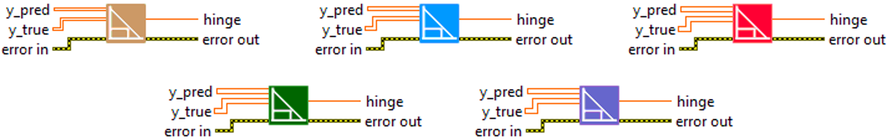
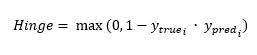

<h1>Hinge</h1>

<h2>Description</h2>

Computes the hinge metric between y_true and y_pred. Type : <em><strong>polymorphic</strong><strong>.</strong></em>

<h3>Input parameters</h3>

<table>
  <tbody>
    <tr>
      <td width="64" valign="top"></td>
      <td valign="top"><strong>y_pred : <em>array, </em></strong>predicted values.</td>
    </tr>
    <tr>
      <td width="64" valign="top"></td>
      <td valign="top"><strong>y_true : <em>array, </em></strong>true values are expected to be -1 or 1. If binary (0 or 1) labels are provided we will convert them to -1 or 1.</td>
    </tr>
  </tbody>
</table>

<h3>Output parameters</h3>

<table>
  <tbody>
    <tr>
      <td width="64" valign="top"></td>
      <td valign="top"><strong>hinge : <em>float, </em></strong>result.</td>
    </tr>
  </tbody>
</table>

<h2>Use cases</h2>

The hinge loss function, also known as margin loss, is a metric used in machine learning, in particular for binary classification problems such as Support Vector Machines (SVM). The hinge loss measures the distance between each data point and the decision frontier, aiming to maximize this distance to better separate classes. This metric is called “margin” loss because it seeks to maximize the margin between classes in the feature space.

It is particularly used in areas where SVMs have traditionally been employed, such as :

<ul>
<li>Image recognition : for example, identifying whether an image contains a cat or a dog.</li>
<li>Spam detection : for example, determining whether an email is spam or not.</li>
<li>Bioinformatics : for example, classifying genetic sequences.</li>
</ul>

It should be noted that although SVMs are often associated with hinge loss, this loss function can also be used with other types of machine learning models.

<h2>Calculation</h2>

The principle of the Hinge metric is to maximise the margin between positive and negative examples. If the prediction is correct and the margin is greater than 1, the loss is 0. If the prediction is incorrect, or if the margin is less than 1, even if the prediction is correct, the loss is calculated as a function of the difference from 1.

So not only does it penalise incorrect classifications, but also correct classifications that are not sufficiently confident. The idea is to encourage the model to make more confident predictions, while minimising errors.

<h2>Example</h2>

All these exemples are snippets PNG, you can drop these Snippet onto the block diagram and get the depicted code added to your VI (Do not forget to install Deep Learning library to run it).

<h3>Easy to use</h3>

