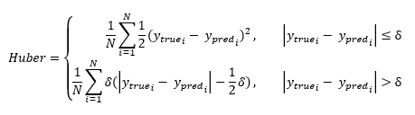

<h1>Huber</h1>

<h2>Description</h2>

Computes the huber metrics between y_true and y_pred. Type : <em><strong>polymorphic</strong><strong>.</strong></em>

<h3>Input parameters</h3>

<table>
  <tbody>
    <tr>
      <td width="64" valign="top"></td>
      <td valign="top"><strong>y_pred : <em>array, </em></strong>predicted values.</td>
    </tr>
    <tr>
      <td width="64" valign="top"></td>
      <td valign="top"><strong>y_true : <em>array, </em></strong>true values.</td>
    </tr>
    <tr>
      <td width="64" valign="top"></td>
      <td valign="top"><strong>delta : <em>float,</em></strong> the point at which the loss changes from quadratic to linear.</td>
    </tr>
  </tbody>
</table>

<h3>Output parameters</h3>

<table>
  <tbody>
    <tr>
      <td width="64" valign="top"></td>
      <td valign="top"><strong>huber : <em>float, </em></strong>result.</td>
    </tr>
  </tbody>
</table>

<h2>Use cases</h2>

Huber’s loss function, also known as Huber’s robust loss, is a metric used in machine learning, particularly for regression problems. It is less sensitive to outliers than the root-mean-square loss, making it useful when there are large prediction errors. It is a function that is quadratic for small values, but linear for large values. This means that it tries to strike a balance between mean square loss (which strongly punishes large errors) and mean absolute loss (which is more robust to outliers).

This loss function is often used in the following areas :

<ul>
<li>
<ul>
<li>Signal processing : for example, when there is noise in the data.</li>
<li>Computer vision : for example, when predicting the positions of objects in an image.</li>
<li>Financial analysis : for example, when predicting the price of shares or other financial securities, where there may be sudden, large price movements.</li>
<li>Robotics : for example, in control problems where models are used to predict forces or positions.</li>
</ul>
</li>
</ul>

Note that the Huber loss function has a parameter called delta, which determines the point at which the loss changes from quadratic to linear. This parameter can be adjusted to control sensitivity to outliers.

<h2>Calculation</h2>

Essentially, the Huber loss is quadratic for small errors and linear for large errors. The threshold between small and large errors is a ‘delta’ hyperparameter that you can adjust.

The advantage of the Huber loss is that it does not penalise large errors as much as the quadratic loss, which makes it more robust to outliers. At the same time, it retains an important property of quadratic loss functions : it is differentiable, which makes it useful for optimisation.

<h2>Example</h2>

All these exemples are snippets PNG, you can drop these Snippet onto the block diagram and get the depicted code added to your VI (Do not forget to install Deep Learning library to run it).

<h3>Easy to use</h3>

