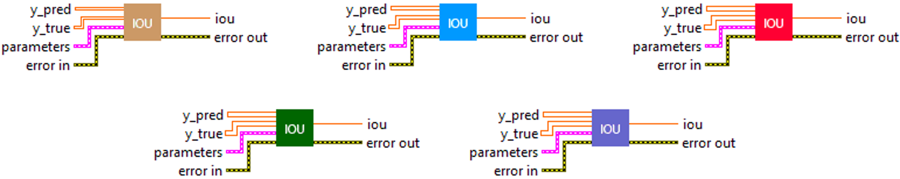
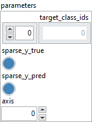
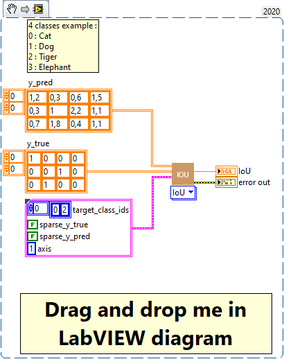
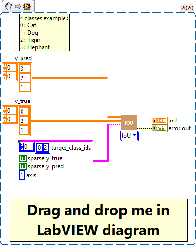

<h1>IoU</h1>

<h2>Description</h2>

Computes the Intersection-Over-Union metric for specific target classes. Type : <em><strong>polymorphic</strong><strong>.</strong></em>

<h3>Input parameters</h3>

<table>
  <tbody>
    <tr>
      <td width="64" valign="top"></td>
      <td valign="top"><strong>y_pred : <em>array, </em></strong>predicted values.</td>
    </tr>
    <tr>
      <td width="64" valign="top"></td>
      <td valign="top"><strong>y_true : <em>array, </em></strong>true values.</td>
    </tr>
  </tbody>
</table>

<table>
  <tbody>
    <tr>
      <td valign="top" width="70%"><table>
  <tbody>
    <tr>
      <td width="64" valign="top"></td>
      <td valign="top"><strong> parameters : <em>cluster,</em></strong></td>
    </tr>
    <tr>
      <td></td>
      <td valign="top"><table>
  <tbody>
    <tr>
      <td width="64" valign="top"></td>
      <td valign="top"><strong>target_class_ids : <em>array,</em></strong> list of target class ids for which the metric is returned.</td>
    </tr>
    <tr>
      <td width="64" valign="top"></td>
      <td valign="top"><strong>sparse_y_true : <em>boolean,</em></strong> whether labels are encoded using integers or one hot logits. If True labels are integers and if False, labels are one hot logits and the argmax function will be used to determine each sample’s most likely associated label according to “axis” parameters.</td>
    </tr>
    <tr>
      <td width="64" valign="top"></td>
      <td valign="top"><strong>sparse_y_pred : <em>boolean,</em></strong> whether predictions are encoded using integers or one hot logits. If True predictions are integers and if False, predictions are one hot logits and the argmax function will be used to determine each sample’s most likely associated label according to “axis” parameters.</td>
    </tr>
    <tr>
      <td width="64" valign="top"></td>
      <td valign="top"><strong>axis : <em>integer,</em></strong> the dimension containing the logits.</td>
    </tr>
  </tbody>
</table></td>
    </tr>
  </tbody>
</table></td>
      <td valign="top" width="30%">

</td>
    </tr>
  </tbody>
</table>

<h3>Output parameters</h3>

<table>
  <tbody>
    <tr>
      <td width="64" valign="top"></td>
      <td valign="top"><strong>iou : <em>float, </em></strong>result.</td>
    </tr>
  </tbody>
</table>

<h2>Use cases</h2>

The IoU metric, which stands for Intersection over Union, is a widely used metric in computer vision, specifically for object detection and semantic segmentation tasks. It measures the correspondence between two sets, which are usually two areas in an image. In the context of object detection, these two sets are usually the ground truth (the actual location of the object in the image) and the model prediction (the location of the object as predicted by the model).

<h2>Calculation</h2>

This metric first computes IoUs for all individual classes, then returns the mean of IoUs for the classes that are specified by <em><strong>“target_class_ids”</strong></em>.

She gives a value between 0 and 1. A value of 0 means that there is no overlap at all, while a value of 1 means that there is perfect overlap (the two bounding boxes are exactly the same).

<table>
  <tbody>
    <tr>
      <td valign="top" width="62%">

</td>
      <td valign="top" width="38%">

</td>
    </tr>
  </tbody>
</table>

<h2>Example</h2>

All these exemples are snippets PNG, you can drop these Snippet onto the block diagram and get the depicted code added to your VI (Do not forget to install Deep Learning library to run it).

<h3>Easy to use with one_hot</h3>

<h3>Easy to use with sparse</h3>

