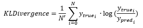

<h1>KLDivergence</h1>

<h2>Description</h2>

Computes Kullback-Leibler divergence metric between y_true and y_pred. Type : <em><strong>polymorphic</strong><strong>.</strong></em>

<h3>Input parameters</h3>

<table>
  <tbody>
    <tr>
      <td width="64" valign="top"></td>
      <td valign="top"><strong>y_pred : <em>array, </em></strong>predicted values.</td>
    </tr>
    <tr>
      <td width="64" valign="top"></td>
      <td valign="top"><strong>y_true : <em>array, </em></strong>true values.</td>
    </tr>
  </tbody>
</table>

<h3>Output parameters</h3>

<table>
  <tbody>
    <tr>
      <td width="64" valign="top"></td>
      <td valign="top"><strong>kl_divergence : <em>float, </em></strong>result.</td>
    </tr>
  </tbody>
</table>

<h2>Use cases</h2>

KL divergence, or Kullback-Leibler divergence, is a measure used in information theory and machine learning to quantify the difference between two probability distributions. It is often used when modeling probabilistic problems and is particularly useful in the field of deep learning.

Here are some specific areas of application :

<ul>
<li>Deep generative models : in generative models such as variational autoencoders (VAE), KL divergence is used to measure the difference between the probability distribution generated by the model and the actual probability distribution of the data.</li>
<li>Unsupervised learning : KL divergence is used in clustering algorithms to measure the difference between the distribution of clusters formed by the algorithm and the actual distribution of the data.</li>
<li>Model optimization : in model selection, KL divergence is sometimes used as a measure of model complexity, helping to prevent overlearning.</li>
<li>Neural networks : in neural networks, KL divergence is used as a loss function when training probabilistic models.</li>
</ul>

<h2>Calculation</h2>

It measures the amount of information ‘lost’ when y_pred is used to approximate y_true. In other words, it gives an idea of how different the y_pred distribution is from the y_true distribution.

N : total of array elements N’ : total of array elements except for the last axis

Example : y_pred shape [3,4,5] ⇒ N = 3*4*5 = 60 and N’ = 3*4 = 12

<h2>Example</h2>

All these exemples are snippets PNG, you can drop these Snippet onto the block diagram and get the depicted code added to your VI (Do not forget to install Deep Learning library to run it).

<h3>Easy to use</h3>

