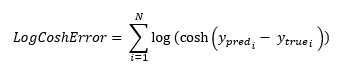
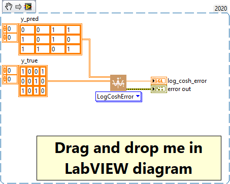

<h1>LogCoshError</h1>

<h2>Description</h2>

Computes the logarithm of the hyperbolic cosine of the prediction error. Type : <em><strong>polymorphic</strong><strong>.</strong></em>

<h3>Input parameters</h3>

<table>
  <tbody>
    <tr>
      <td width="64" valign="top"></td>
      <td valign="top"><strong>y_pred : <em>array, </em></strong>predicted values.</td>
    </tr>
    <tr>
      <td width="64" valign="top"></td>
      <td valign="top"><strong>y_true : <em>array, </em></strong>true values.</td>
    </tr>
  </tbody>
</table>

<h3>Output parameters</h3>

<table>
  <tbody>
    <tr>
      <td width="64" valign="top"></td>
      <td valign="top"><strong>log_cosh_error : <em>float, </em></strong>result.</td>
    </tr>
  </tbody>
</table>

<h2>Use cases</h2>

The LogCosh loss function, is a metric used in machine learning, specifically for regression problems. It is an alternative to mean square loss and mean absolute loss, and is particularly useful when there are outliers in the data. It is the logarithmic function of the hyperbolic cosine of the prediction error. It acts as a root-mean-square loss for small errors and as a root-mean-absolute loss for large errors. This makes it less sensitive to outliers than mean square loss.

Here are a few specific areas of application :

<ul>
<li>
<ul>
<li>Price prediction : in econometrics or finance, the LogCosh loss function can be used to predict the prices of real estate, stocks, etc. These data can often have outliers. These data can often have significant outliers, such as sudden price changes or extremely high values.</li>
<li>Demand prediction : in supply chain management or logistics, the LogCosh loss function can be used to predict product demand. These predictions can also be affected by outliers, such as sudden and unexpected demand for a product.</li>
<li>Air quality prediction : in environmentalism or public health, the LogCosh loss function can be used to predict air quality. These data may have outliers due to events such as forest fires or industrial pollution.</li>
</ul>
</li>
</ul>

<h2>Calculation</h2>

The cosh(x) function is very similar to the |x| function, but is gentler on small values of x. When applied to the difference between the predicted value and the true value, it gives a less severe penalty for large errors compared with the Mean Squared Error.

The logarithm is then applied to further attenuate the effect of large errors and give greater weight to small errors. In this way, log-cosh loss provides a robust measure of regression error that is less sensitive to outliers.

<h2>Example</h2>

All these exemples are snippets PNG, you can drop these Snippet onto the block diagram and get the depicted code added to your VI (Do not forget to install Deep Learning library to run it).

<h3>Easy to use</h3>

