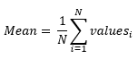

<h1>Mean</h1>

<h2>Description</h2>

Computes the mean of the given values. Type : <em><strong>polymorphic</strong><strong>.</strong></em>

<h3>Input parameters</h3>

<table>
  <tbody>
    <tr>
      <td width="64" valign="top"></td>
      <td valign="top"><strong>values : <em>array, </em></strong>values to be mean.</td>
    </tr>
  </tbody>
</table>

<h3>Output parameters</h3>

<table>
  <tbody>
    <tr>
      <td width="64" valign="top"></td>
      <td valign="top"><strong>mean : <em>float, </em></strong>result.</td>
    </tr>
  </tbody>
</table>

<h2>Use cases</h2>

The mean metric is one of the most fundamental statistics, used in a wide variety of fields and contexts. In machine learning, it is commonly used to calculate the average loss on a data set during model training, or to evaluate the average performance of a model on a test set.

Here are a few specific examples of how the mean metric is used :

<ul>
<li>
<ul>
<li>Model evaluation : in supervised learning, we often calculate the average error over a test set to evaluate a model’s performance. For example, in a regression problem, the Mean Squared Error (MSE) could be used to assess model quality.</li>
<li>Image processing : in computer vision, the mean can be used to calculate image statistics, such as the average brightness or color of an image.</li>
<li>Social sciences : in the social sciences and research in general, the average is often used to summarize a set of data. For example, we might calculate the average income or average age in a given population.</li>
<li>Learning optimization : in training deep learning models, it is common to use a version of gradient descent called “mini-batch stochastic gradient descent”, which updates model weights according to the average error over a small data set (a “batch”).</li>
</ul>
</li>
</ul>

<h2>Calculation</h2>

The mean metric is a statistical measure that calculates the arithmetic mean of a set of numbers.

<h2>Example</h2>

All these exemples are snippets PNG, you can drop these Snippet onto the block diagram and get the depicted code added to your VI (Do not forget to install Deep Learning library to run it).

<h3>Easy to use</h3>

