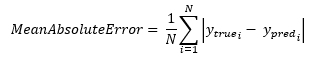
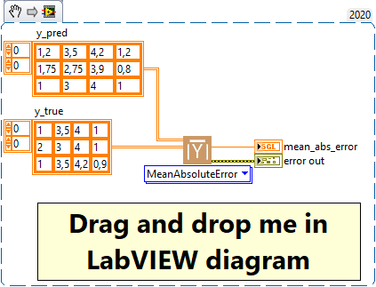

<h1>MeanAbsoluteError</h1>

<h2>Description</h2>

Computes the mean absolute error between the labels and predictions. Type : <em><strong>polymorphic</strong><strong>.</strong></em>

<h3>Input parameters</h3>

<table>
  <tbody>
    <tr>
      <td width="64" valign="top"></td>
      <td valign="top"><strong>y_pred : <em>array, </em></strong>predicted values.</td>
    </tr>
    <tr>
      <td width="64" valign="top"></td>
      <td valign="top"><strong>y_true : <em>array, </em></strong>true values.</td>
    </tr>
  </tbody>
</table>

<h3>Output parameters</h3>

<table>
  <tbody>
    <tr>
      <td width="64" valign="top"></td>
      <td valign="top"><strong>mean_abs_error : <em>float, </em></strong>result.</td>
    </tr>
  </tbody>
</table>

<h2>Use cases</h2>

Mean Absolute Error (MAE) is a metric commonly used in machine learning, specifically in regression problems. It measures the average absolute differences between predictions and ground truths, i.e. how much the model’s predictions differ on average from the truth.

Here are some specific areas where MAE is commonly used :

<ul>
<li>
<ul>
<li>Sales prediction : in sales prediction problems, MAE can be used to measure how much a model’s sales predictions differ from actual sales.</li>
<li>Weather forecasting : MAE can be used to evaluate the performance of models that forecast continuous quantities such as temperature or precipitation.</li>
<li>Energy estimation : in energy estimation problems, such as predicting the energy output of a wind turbine or solar panel, MAE can be used to evaluate model performance.</li>
<li>Finance : in problems involving the prediction of stock prices or other financial values, MAE can be used to assess how much the model’s predictions differ from the actual price.</li>
</ul>
</li>
</ul>

One advantage of the MAE is that it is easy to interpret, as it gives a direct average measure of error in terms of the unit of the variable being predicted. Another advantage is that it penalizes large errors less than other metrics such as Mean Squared Error (<a href="../meansquarederror-2/README.md">MSE</a>), which may be preferable if you want to avoid giving too much importance to outliers.

<h2>Calculation</h2>

Mean Absolute Error (MAE) is a regression metric that measures the mean of the absolute differences between predicted and actual values. For each pair of values (predicted and actual), we calculate their absolute difference. We do this for all the samples in our dataset and then calculate the average of these absolute errors. In this way, the MAE represents the average error of our predictions. A smaller MAE means that our predictions are closer to the true values, indicating a better prediction model.

<h2>Example</h2>

All these exemples are snippets PNG, you can drop these Snippet onto the block diagram and get the depicted code added to your VI (Do not forget to install Deep Learning library to run it).

<h3>Easy to use</h3>

