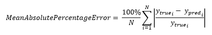
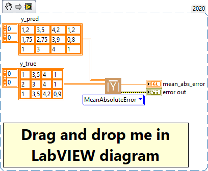

<h1>MeanAbsolutePercentageError</h1>

<h2>Description</h2>

Computes the mean absolute percentage error between y_true and y_pred. Type : <em><strong>polymorphic</strong><strong>.</strong></em>

<h3>Input parameters</h3>

<table>
  <tbody>
    <tr>
      <td width="64" valign="top"></td>
      <td valign="top"><strong>y_pred : <em>array, </em></strong>predicted values.</td>
    </tr>
    <tr>
      <td width="64" valign="top"></td>
      <td valign="top"><strong>y_true : <em>array, </em></strong>true values.</td>
    </tr>
  </tbody>
</table>

<h3>Output parameters</h3>

<table>
  <tbody>
    <tr>
      <td width="64" valign="top"></td>
      <td valign="top"><strong>mean_abs_percent_error : <em>float, </em></strong>result.</td>
    </tr>
  </tbody>
</table>

<h2>Calculation</h2>

Mean Absolute Percentage Error (MAPE) is a metric often used in statistics, forecasting and machine learning, specifically for regression problems. It measures the mean absolute percentage error, i.e. how much the model’s predictions differ in percentage from the ground truth. It’s a useful measure when you want to express error in relative rather than absolute terms.

Here are some specific areas where MAPE is commonly used :

<ul>
<li>
<ul>
<li>Sales forecasting : in sales forecasting problems, MAPE can be used to assess how much a model’s sales forecast differs from actual sales in percentage terms. This puts the error into perspective in relation to the magnitude of actual sales.</li>
<li>Demand forecasting : in demand forecasting problems, such as electricity demand forecasting, MAPE can be used to assess the percentage error, which can help to understand the error in terms of capacity or total demand.</li>
<li>Finance : in problems involving the prediction of share prices or other financial values, MAPE can be used to assess how much the model’s predictions differ from the actual price in percentage terms. This can be useful for understanding the error in terms of return on investment.</li>
</ul>
</li>
</ul>

An advantage of MAPE is that it expresses error in relative terms, which can be easier to interpret than absolute errors, particularly when the magnitude of the variable we’re trying to predict varies greatly. However, it also has drawbacks, such as the fact that it can be indefinite if the ground truth is zero, and that it can give disproportionate weight to errors on small values.

<h2>Calculation</h2>

Mean Absolute Percentage Error (MAPE) is a measure of the prediction error of a regression model. For each observation, MAPE calculates the absolute difference between the actual value and the predicted value, then divides it by the actual value, giving the percentage error for each observation. These percentage errors are then averaged over the whole sample to obtain the MAPE. A lower MAPE indicates a better model fit. It is particularly useful when you want to express the prediction error in percentage terms rather than in the original unit of measurement.

<h2>Example</h2>

All these exemples are snippets PNG, you can drop these Snippet onto the block diagram and get the depicted code added to your VI (Do not forget to install Deep Learning library to run it).

<h3>Easy to use</h3>

