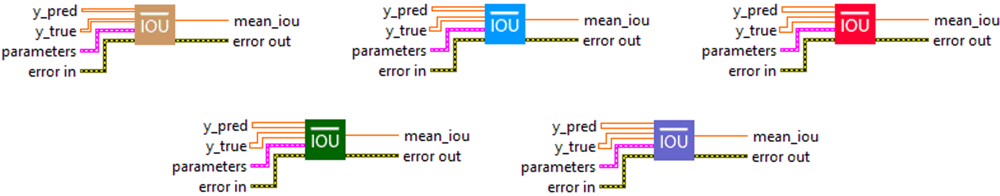
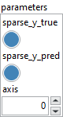
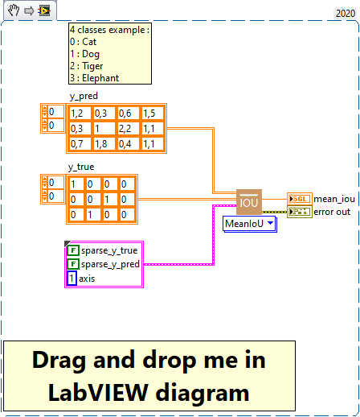
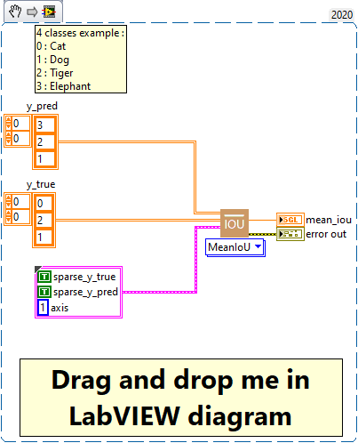

<h1>MeanIoU</h1>

<h2>Description</h2>

Computes the mean Intersection-Over-Union metric. Type : <em><strong>polymorphic</strong><strong>.</strong></em>

<h3>Input parameters</h3>

<table>
  <tbody>
    <tr>
      <td width="64" valign="top"></td>
      <td valign="top"><strong>y_pred : <em>array, </em></strong>predicted values.</td>
    </tr>
    <tr>
      <td width="64" valign="top"></td>
      <td valign="top"><strong>y_true : <em>array, </em></strong>true values.</td>
    </tr>
  </tbody>
</table>

<table>
  <tbody>
    <tr>
      <td valign="top" width="70%"><table>
  <tbody>
    <tr>
      <td width="64" valign="top"></td>
      <td valign="top"><strong> parameters : <em>cluster,</em></strong></td>
    </tr>
    <tr>
      <td></td>
      <td valign="top"><table>
  <tbody>
    <tr>
      <td width="64" valign="top"></td>
      <td valign="top"><strong>sparse_y_true : <em>boolean,</em></strong> whether labels are encoded using integers or one hot logits. If True labels are integers and if False, labels are one hot logits and the argmax function will be used to determine each sample’s most likely associated label according to “axis” parameters.</td>
    </tr>
    <tr>
      <td width="64" valign="top"></td>
      <td valign="top"><strong>sparse_y_pred : <em>boolean,</em></strong> whether predictions are encoded using integers or one hot logits. If True predictions are integers and if False, predictions are one hot logits and the argmax function will be used to determine each sample’s most likely associated label according to “axis” parameters.</td>
    </tr>
    <tr>
      <td width="64" valign="top"></td>
      <td valign="top"><strong>axis : <em>integer,</em></strong> the dimension containing the logits.</td>
    </tr>
  </tbody>
</table></td>
    </tr>
  </tbody>
</table></td>
      <td valign="top" width="30%">

</td>
    </tr>
  </tbody>
</table>

<h3>Output parameters</h3>

<table>
  <tbody>
    <tr>
      <td width="64" valign="top"></td>
      <td valign="top"><strong>mean_iou : <em>float, </em></strong>result.</td>
    </tr>
  </tbody>
</table>

<h2>Use cases</h2>

Mean Intersection over Union (Mean IoU) is a metric often used in computer vision, more specifically in image segmentation problems.

Intersection over Union” (IoU) is a metric that evaluates the accuracy of an object detected by a model in relation to the ground truth. It calculates the size of the intersection of the two sets (the area of the object detected by the model and the actual area of the object) and divides it by the size of their union.

The “Mean IoU”, as the name suggests, is simply the average of these IoU measurements for all objects in an image or set of images.

Here are some specific areas where Mean IoU is commonly used :

<ul>
<li>
<ul>
<li>Object detection : in object detection problems, where the aim is to find where one or more specific objects are in an image, Mean IoU can be used to assess the accuracy of model detections.</li>
<li>Image segmentation : in image segmentation problems, where the aim is to classify each pixel in an image as belonging to a certain object or background, Mean IoU is a commonly used metric for assessing the accuracy of segmentation.</li>
<li>Object tracking : in object tracking problems, where the aim is to track the position of an object through a series of images or a video, Mean IoU can be used to assess tracking accuracy.</li>
</ul>
</li>
</ul>

Mean IoU is a useful metric because it takes into account both false positives (when the model detects an object that isn’t there) and false negatives (when the model doesn’t detect an object that is), and it gives an idea of the spatial accuracy of detection or segmentation. However, it can be sensitive to object size, giving greater weight to large objects than to small ones.

<h2>Calculation</h2>

This metric first computes IoUs for all individual classes, then returns the mean of these values.

<table>
  <tbody>
    <tr>
      <td valign="top" width="62%">

</td>
      <td valign="top" width="38%">

</td>
    </tr>
  </tbody>
</table>

<h2>Example</h2>

All these exemples are snippets PNG, you can drop these Snippet onto the block diagram and get the depicted code added to your VI (Do not forget to install Deep Learning library to run it).

<h3>Easy to use with one_hot</h3>

<h3>Easy to use with sparse</h3>

