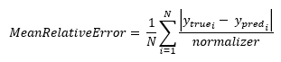
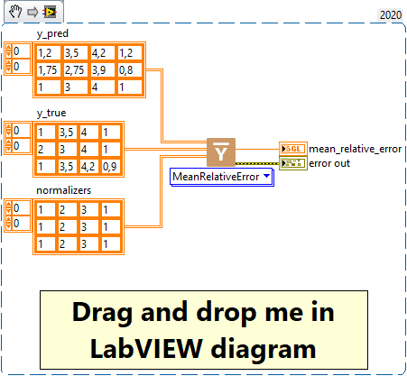

<h1>MeanRelativeError</h1>

<h2>Description</h2>

Computes the mean relative error by normalizing with the given values. Type : <em><strong>polymorphic</strong><strong>.</strong></em>

<h3>Input parameters</h3>

<table>
  <tbody>
    <tr>
      <td width="64" valign="top"></td>
      <td valign="top"><strong>y_pred : <em>array, </em></strong>predicted values.</td>
    </tr>
    <tr>
      <td width="64" valign="top"></td>
      <td valign="top"><strong>y_true : <em>array, </em></strong>true values.</td>
    </tr>
    <tr>
      <td width="64" valign="top"></td>
      <td valign="top"><strong>normalizer : <em>array, </em></strong>the normalizer values with same shape as predictions.</td>
    </tr>
  </tbody>
</table>

<h3>Output parameters</h3>

<table>
  <tbody>
    <tr>
      <td width="64" valign="top"></td>
      <td valign="top"><strong>mean_relative_error : <em>float, </em></strong>result.</td>
    </tr>
  </tbody>
</table>

<h2>Use cases</h2>

Mean Relative Error (MRE) is an error measure often used in machine learning for regression problems. MRE measures the mean relative error, i.e. how much the model’s predictions differ in percentage from the ground truth. It is similar to Mean Absolute Percentage Error (<a href="https://haibal.com/documentation/mean-absolute-percentage-error/">MAPE</a>), but does not take the absolute value of the errors before averaging them, which means it can be positive or negative depending on whether the predictions are on average below or above the ground truth.

Here are some specific areas where MRE is commonly used :

<ul>
<li>
<ul>
<li>Sales forecasting : in sales forecasting problems, MRE can be used to assess how far a model’s sales predictions differ from actual sales in percentage terms.</li>
<li>Demand forecasting : in demand forecasting problems, such as electricity demand forecasting, MRE can be used to assess the percentage error, which can help to understand the error in terms of capacity or total demand.</li>
<li>Finance : in problems involving the prediction of share prices or other financial values, MRE can be used to assess how much the model’s predictions differ from the actual price in percentage terms.</li>
</ul>
</li>
</ul>

One advantage of the MRE is that it expresses error in relative terms, which can be easier to interpret than absolute errors, particularly when the magnitude of the variable being predicted varies widely. However, it also has disadvantages, such as the fact that it can be sensitive to outliers and can be undefined if the ground truth is zero.

<h2>Calculation</h2>

The Mean Relative Error is a measure of the prediction error relative to a normalisation value. For each prediction, we first calculate the absolute error (the difference between the prediction y_pred and the true value y_true). This error is then normalised by dividing it by a normalizer, producing a relative error. Finally, we calculate the average of these relative errors for all the samples. A smaller average relative error indicates that, on average, the prediction errors are small compared to the normalizer value.

<h2>Example</h2>

All these exemples are snippets PNG, you can drop these Snippet onto the block diagram and get the depicted code added to your VI (Do not forget to install Deep Learning library to run it).

<h3>Easy to use</h3>

