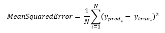
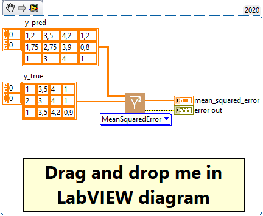

<h1>MeanSquaredError</h1>

<h2>Description</h2>

Computes the mean squared error between y_true and y_pred. Type : <em><strong>polymorphic</strong><strong>.</strong></em>

<h3>Input parameters</h3>

<table>
  <tbody>
    <tr>
      <td width="64" valign="top"></td>
      <td valign="top"><strong>y_pred : <em>array, </em></strong>predicted values.</td>
    </tr>
    <tr>
      <td width="64" valign="top"></td>
      <td valign="top"><strong>y_true : <em>array, </em></strong>true values.</td>
    </tr>
  </tbody>
</table>

<h3>Output parameters</h3>

<table>
  <tbody>
    <tr>
      <td width="64" valign="top"></td>
      <td valign="top"><strong>mean_squared_error : <em>float, </em></strong>result.</td>
    </tr>
  </tbody>
</table>

<h2>Use cases</h2>

Mean Squared Error (MSE) is a measure commonly used in statistics and machine learning, particularly for regression problems. It measures the mean squared differences between model predictions and ground truths, i.e. how far the model predictions are from the truth.

Here are some specific areas where MSE is commonly used :

<ul>
<li>
<ul>
<li>Sales prediction : in sales prediction problems, MSE can be used to measure how far a model’s sales predictions differ from actual sales.</li>
<li>Weather forecasting : MSE can be used to evaluate the performance of models that forecast continuous quantities such as temperature or precipitation.</li>
<li>Energy estimation : in energy estimation problems, such as predicting the energy output of a wind turbine or solar panel, MSE can be used to evaluate model performance.</li>
<li>Finance : in problems involving the prediction of stock prices or other financial values, MSE can be used to assess the extent to which the model’s predictions differ from the actual price.</li>
</ul>
</li>
</ul>

The advantage of MSE is that it strongly penalizes large errors thanks to squaring, which can be desirable when large errors are to be avoided. However, one disadvantage is that MSE is in squared units, which can make it more difficult to interpret than other error measures such as mean absolute error (<a href="../meanabsoluteerror-2/README.md">MAE</a>). In addition, as MSE gives greater weight to large errors, it can be very sensitive to outliers.

<h2>Calculation</h2>

Mean Squared Error (MSE) is a metric commonly used to assess the accuracy of a prediction model, particularly in regression tasks. For each prediction-actual value pair (y_pred and y_true), the difference is first calculated and then squared. This gives the squared error for each sample. We then calculate the average of these squared errors over all the samples. A smaller MSE means that the model’s predictions are close to the actual values, indicating a better prediction model.

<h2>Example</h2>

All these exemples are snippets PNG, you can drop these Snippet onto the block diagram and get the depicted code added to your VI (Do not forget to install Deep Learning library to run it).

<h3>Easy to use</h3>

