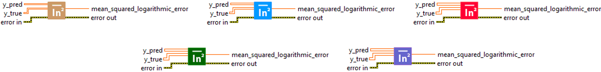
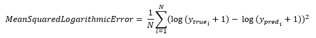
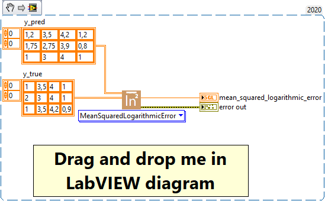

<h1>MeanSquaredLogarithmicError</h1>

<h2>Description</h2>

Computes the mean squared logarithmic error between y_true and y_pred. Type : <em><strong>polymorphic</strong><strong>.</strong></em>

<h3>Input parameters</h3>

<table>
  <tbody>
    <tr>
      <td width="64" valign="top"></td>
      <td valign="top"><strong>y_pred : <em>array, </em></strong>predicted values.</td>
    </tr>
    <tr>
      <td width="64" valign="top"></td>
      <td valign="top"><strong>y_true : <em>array, </em></strong>true values.</td>
    </tr>
  </tbody>
</table>

<h3>Output parameters</h3>

<table>
  <tbody>
    <tr>
      <td width="64" valign="top"></td>
      <td valign="top"><strong>mean_squared_logarithmic_error : <em>float, </em></strong>result.</td>
    </tr>
  </tbody>
</table>

<h2>Use cases</h2>

The Mean Squared Logarithmic Error (MSLE) metric is often used in machine learning, specifically in regression problems. It is particularly useful when you want to focus on relative rather than absolute errors, and when you want to penalize large errors less than Mean Squared Error (<a href="https://haibal.com/documentation/mean-squared-error/">MSE</a>).

Here are a few specific areas where MSLE is commonly used :

<ul>
<li>
<ul>
<li>Sales forecasting: In sales forecasting problems, MSLE can be used to assess how much a model’s sales forecast differs from actual sales in percentage terms, rather than in absolute terms.</li>
<li>Demand forecasting: In demand forecasting problems, such as electricity demand forecasting, MSLE can be used to assess the percentage error, which can help to understand the error in terms of capacity or total demand.</li>
<li>Finance: In problems involving the prediction of share prices or other financial values, MSLE can be used to assess the extent to which model predictions differ from the actual price in percentage terms.</li>
</ul>
</li>
</ul>

The advantage of MSLE is that it focuses on relative rather than absolute errors, which can be useful when the magnitude of the variable you are trying to predict varies greatly. It is also less sensitive to large errors than <a href="https://haibal.com/documentation/mean-squared-error/">MSE</a>, which can be useful when you want to avoid giving too much importance to outliers.

<h2>Calculation</h2>

The Mean Squared Logarithmic Error (MSLE) is a metric adapted to regression problems where we want to give more importance to errors on small values. For each prediction (y_pred) and each true value (y_true), we first check whether they are negative. If they are, we replace them with zero. Next, we apply the logarithm of each value plus one (to avoid infinite values), calculate the difference between these logarithms and square this difference. The average of these values for all the samples gives the MSLE. A smaller MSLE means a better model fit.

<h2>Example</h2>

All these exemples are snippets PNG, you can drop these Snippet onto the block diagram and get the depicted code added to your VI (Do not forget to install Deep Learning library to run it).

<h3>Easy to use</h3>

