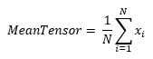

<h1>MeanTensor</h1>

<h2>Description</h2>

Computes the element-wise mean of the given tensors. Type : <em><strong>polymorphic</strong><strong>.</strong></em>

<h3>Input parameters</h3>

<table>
  <tbody>
    <tr>
      <td width="64" valign="top"></td>
      <td valign="top"><strong>tensor1 : <em>array, </em></strong>values of the first tensor.</td>
    </tr>
    <tr>
      <td width="64" valign="top"></td>
      <td valign="top"><strong>tensor2 : <em>array, </em></strong>values of the second tensor.</td>
    </tr>
  </tbody>
</table>

<h3>Output parameters</h3>

<table>
  <tbody>
    <tr>
      <td width="64" valign="top"></td>
      <td valign="top"><strong>mean_tensor : <em>float, </em></strong>result.</td>
    </tr>
  </tbody>
</table>

<h2>Calculation</h2>

The MeanTensor function calculates the element-by-element average of two tensors with the same shape.

<h2>Example</h2>

All these exemples are snippets PNG, you can drop these Snippet onto the block diagram and get the depicted code added to your VI (Do not forget to install Deep Learning library to run it).

<h3>Easy to use</h3>

