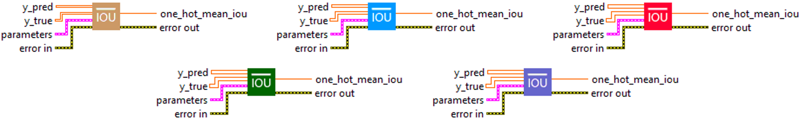
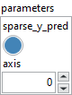
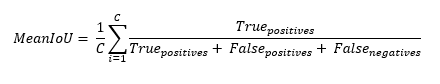
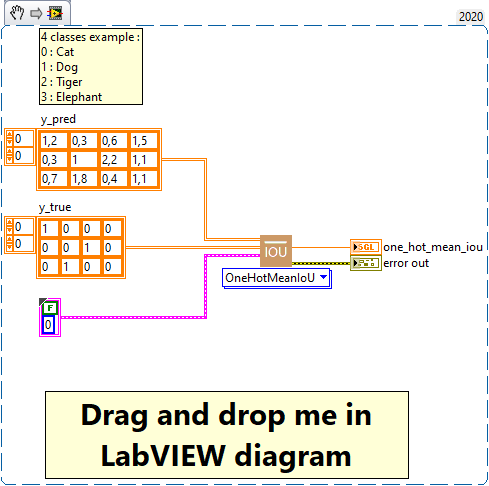
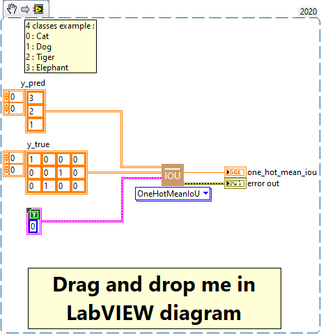

<h1>OneHotMeanIoU</h1>

<h2>Description</h2>

Computes mean Intersection-Over-Union metric for one-hot encoded labels. Type : <em><strong>polymorphic</strong><strong>.</strong></em>

<h3>Input parameters</h3>

<table>
  <tbody>
    <tr>
      <td width="64" valign="top"></td>
      <td valign="top"><strong>y_pred : <em>array, </em></strong>predicted values.</td>
    </tr>
    <tr>
      <td width="64" valign="top"></td>
      <td valign="top"><strong>y_true : <em>array, </em></strong>true values (one hot encoding for example, [0, 0, 1] for 3-class problem).</td>
    </tr>
  </tbody>
</table>

<table>
  <tbody>
    <tr>
      <td valign="top" width="70%"><table>
  <tbody>
    <tr>
      <td width="64" valign="top"></td>
      <td valign="top"><strong> parameters : <em>cluster,</em></strong></td>
    </tr>
    <tr>
      <td></td>
      <td valign="top"><table>
  <tbody>
    <tr>
      <td width="64" valign="top"></td>
      <td valign="top"><strong>sparse_y_pred : <em>boolean,</em></strong> whether predictions are encoded using integers or one hot logits. If True predictions are integers and if False, predictions are one hot logits and the argmax function will be used to determine each sample’s most likely associated label according to “axis” parameters.</td>
    </tr>
    <tr>
      <td width="64" valign="top"></td>
      <td valign="top"><strong>axis : <em>integer,</em></strong> the dimension containing the logits.</td>
    </tr>
  </tbody>
</table></td>
    </tr>
  </tbody>
</table></td>
      <td valign="top" width="30%">

</td>
    </tr>
  </tbody>
</table>

<h3>Output parameters</h3>

<table>
  <tbody>
    <tr>
      <td width="64" valign="top"></td>
      <td valign="top"><strong>one_hot_mean_iou : <em>float, </em></strong>result.</td>
    </tr>
  </tbody>
</table>

<h2>Calculation</h2>

This metric can be used to compute mean IoU for multi-class classification tasks where the labels are one-hot encoded (the last axis should have one dimension per class). If the boolean parameter sparse_y_pred is set to true, this means that the predictions are not encoded in one-hot, but are sparse integers. Consequently, it is not necessary to convert them to integer format using argmax on the class axis. Otherwise, if sparse_y_pred is false, then the labels and predictions are first converted to integer format using argmax on the class axis before the IoU is calculated.

So, depending on the value of sparse_y_pred, MeanOneHotIoU can accommodate both one-hot encoded predictions and sparse integer predictions.

Note, if there is only one channel in the labels and predictions, this class is the same as class MeanIoU. In this case, use <a href="https://haibal.com/documentation/mean-iou/">MeanIoU</a> instead.

<table>
  <tbody>
    <tr>
      <td valign="top" width="62%">

</td>
      <td valign="top" width="38%">

</td>
    </tr>
  </tbody>
</table>

<h2>Example</h2>

All these exemples are snippets PNG, you can drop these Snippet onto the block diagram and get the depicted code added to your VI (Do not forget to install Deep Learning library to run it).

<h3>Easy to use with one_hot</h3>

<h3>Easy to use with sparse</h3>

