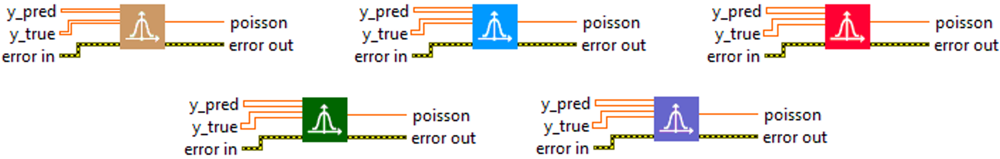
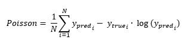

<h1>Poisson</h1>

<h2>Description</h2>

Computes the poisson metric between y_true and y_pred. Type : <em><strong>polymorphic</strong><strong>.</strong></em>

<h3>Input parameters</h3>

<table>
  <tbody>
    <tr>
      <td width="64" valign="top"></td>
      <td valign="top"><strong>y_pred : <em>array, </em></strong>predicted values.</td>
    </tr>
    <tr>
      <td width="64" valign="top"></td>
      <td valign="top"><strong>y_true : <em>array, </em></strong>true values.</td>
    </tr>
  </tbody>
</table>

<h3>Output parameters</h3>

<table>
  <tbody>
    <tr>
      <td width="64" valign="top"></td>
      <td valign="top"><strong>poisson : <em>float, </em></strong>result.</td>
    </tr>
  </tbody>
</table>

<h2>Use cases</h2>

The “Poisson” or Poisson loss metric is a loss function used in regression problems in machine learning. More specifically, it is used when the target data are counts or non-negative integers, corresponding to a Poisson distribution.

Here are some specific areas where Poisson loss can be used :

<ul>
<li>
<ul>
<li>Object counting : in object counting problems, such as counting the number of cars in a picture or the number of people in a crowd, Poisson loss can be used to train a regression model.</li>
<li>Demand prediction : in demand prediction problems, such as predicting how many products will be sold in a store, Poisson loss can be used to drive a regression model.</li>
<li>Bioinformatics and genomics : in bioinformatics and genomics problems, where the data are often counts of genetic events (such as the number of mutations), Poisson loss can be used.</li>
</ul>
</li>
</ul>

One advantage of the Poisson loss is that it is more appropriate for count data than other regression losses such as root mean square error. However, it assumes that the mean and variance of the target data are equal, which is not always the case in practice.

<h2>Calculation</h2>

Poisson Error is an error metric used for regression problems, particularly when errors are expected to follow a Poisson distribution. This metric compares the predicted value y_pred to the true value y_true using the formula y_pred – y_true * log(y_pred). Compared to other error metrics, the Poisson Error puts more emphasis on prediction errors when y_true is small, which is consistent with the properties of a Poisson distribution. A smaller Poisson Error indicates a more accurate prediction model.

<h2>Example</h2>

All these exemples are snippets PNG, you can drop these Snippet onto the block diagram and get the depicted code added to your VI (Do not forget to install Deep Learning library to run it).

<h3>Easy to use</h3>

