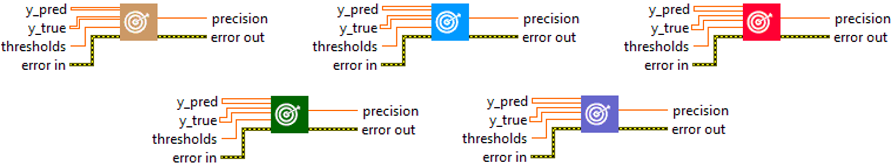
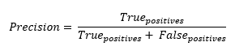

<h1>Precision</h1>

<h2>Description</h2>

Computes the precision of the predictions with respect to the labels. Type : <em><strong>polymorphic</strong><strong>.</strong></em>

<h3>Input parameters</h3>

<table>
  <tbody>
    <tr>
      <td width="64" valign="top"></td>
      <td valign="top"><strong>y_pred : <em>array, </em></strong>predicted values (logits values).</td>
    </tr>
    <tr>
      <td width="64" valign="top"></td>
      <td valign="top"><strong>y_true : <em>array, </em></strong>true values (logits values, or binary values if the threshold value is between 0 and 1).</td>
    </tr>
    <tr>
      <td width="64" valign="top"></td>
      <td valign="top"><strong> thresholds : <em>float,</em></strong> representing the threshold for deciding whether prediction and true values are 1 or 0 (above the threshold is true, below is false).</td>
    </tr>
  </tbody>
</table>

<h3>Output parameters</h3>

<table>
  <tbody>
    <tr>
      <td width="64" valign="top"></td>
      <td valign="top"><strong>precision : <em>float, </em></strong>result.</td>
    </tr>
  </tbody>
</table>

<h2>Use cases</h2>

Accuracy is a widely used metric in binary and multiclass classification tasks in machine learning. Accuracy is the ratio between the number of true positives (examples correctly identified as belonging to a specific class) and the sum of true positives and false positives (examples incorrectly identified as belonging to that class).

Precision is therefore a measure of a model’s ability to avoid labeling a negative sample as positive. It is used when the costs of false positives are high. For example :

<ul>
<li>
<ul>
<li>Information retrieval : when searching for relevant documents or information on the web, we want to minimize the number of irrelevant results (false positives).</li>
<li>Medical diagnosis : in disease detection, it’s important to minimize false positives, as a false positive diagnosis could lead to unnecessary or inappropriate treatment.</li>
<li>Spam detection : when classifying e-mails as “spam” or “non-spam”, we want to minimize the number of false positives, as a legitimate e-mail classified as spam (a false positive) could result in the loss of important messages.</li>
<li>Fraud detection systems : in banking and finance, it is crucial to minimize the number of legitimate transactions wrongly identified as fraudulent (false positives), as this could lead to customer inconvenience.</li>
</ul>
</li>
</ul>

<h2>Calculation</h2>

Precision is a measure commonly used to evaluate classification models. It is calculated as the number of true positives (TP) divided by the sum of true positives and false positives (FP), i.e. TP / (TP + FP). True positives are cases where the model correctly predicts the positive class, while false positives are cases where the model incorrectly predicts the positive class. High precision means that the model accurately predicts the positive class, but does not take into account its effectiveness in correctly predicting the negative class.

<h2>Example</h2>

All these exemples are snippets PNG, you can drop these Snippet onto the block diagram and get the depicted code added to your VI (Do not forget to install Deep Learning library to run it).

<h3>Easy to use</h3>

