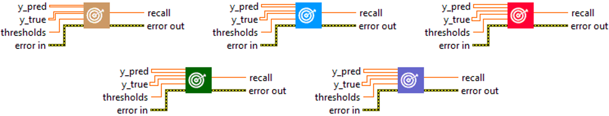

<h1>Recall</h1>

<h2>Description</h2>

Computes the recall of the predictions with respect to the labels. Type : <em><strong>polymorphic</strong><strong>.</strong></em>

<h3>Input parameters</h3>

<table>
  <tbody>
    <tr>
      <td width="64" valign="top"></td>
      <td valign="top"><strong>y_pred : <em>array, </em></strong>predicted values.</td>
    </tr>
    <tr>
      <td width="64" valign="top"></td>
      <td valign="top"><strong>y_true : <em>array, </em></strong>true values.</td>
    </tr>
    <tr>
      <td width="64" valign="top"></td>
      <td valign="top"><strong> thresholds : <em>float,</em></strong> representing the threshold for deciding whether prediction and true values are 1 or 0 (above the threshold is true, below is false).</td>
    </tr>
  </tbody>
</table>

<h3>Output parameters</h3>

<table>
  <tbody>
    <tr>
      <td width="64" valign="top"></td>
      <td valign="top"><strong>recall : <em>float, </em></strong>result.</td>
    </tr>
  </tbody>
</table>

<h2>Use cases</h2>

Recall (or sensitivity) is a measure commonly used in binary and multiclass classification tasks in machine learning. This is a measure of a model’s ability to find all positive samples. It is particularly useful when the cost of false negatives is high.

Here are a few examples :

<ul>
<li>
<ul>
<li>Medical diagnosis : in disease detection, it is very important to minimize the number of false negatives (undetected diseases), as an undetected disease can have serious consequences for the patient. Recall is therefore a very important measure in this field.</li>
<li>Fraud detection : in fraud detection, it is also crucial to minimize the number of undetected frauds (false negatives). A high recall rate is therefore sought.</li>
<li>Recommender systems : in recommender systems, high recall means that the system is able to recommend most of the items that are actually relevant to the user. A high recall rate is therefore generally desired.</li>
<li>Search engines : in search engines, high recall means that the engine is able to return most web pages that are relevant to the user’s query. A high recall rate is therefore generally desired.</li>
</ul>
</li>
</ul>

<h2>Calculation</h2>

Recall, or sensitivity, is a crucial metric for evaluating classification models. It is calculated by dividing the number of true positives (TP) by the sum of true positives and false negatives (FN), i.e. TP / (TP + FN). True positives are cases where the model correctly predicts the positive class, while false negatives are cases where the model incorrectly predicts the negative class when it is the positive class. A high recall indicates that the model is good at detecting true positives, but does not take into account its accuracy in predicting the positive class.

<h2>Example</h2>

All these exemples are snippets PNG, you can drop these Snippet onto the block diagram and get the depicted code added to your VI (Do not forget to install Deep Learning library to run it).

<h3>Easy to use</h3>

