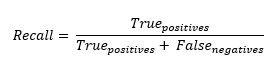

<h1>RecallAtPrecision</h1>

<h2>Description</h2>

Computes best recall where precision is &gt; specified value. Type : <em><strong>polymorphic</strong><strong>.</strong></em>

<h3>Input parameters</h3>

<table>
  <tbody>
    <tr>
      <td width="64" valign="top"></td>
      <td valign="top"><strong>y_pred : <em>array, </em></strong>predicted values.</td>
    </tr>
    <tr>
      <td width="64" valign="top"></td>
      <td valign="top"><strong>y_true : <em>array, </em></strong>true values.</td>
    </tr>
    <tr>
      <td width="64" valign="top"></td>
      <td valign="top"><strong> precision : <em>float,</em></strong> a scalar value in range [0, 1].</td>
    </tr>
    <tr>
      <td width="64" valign="top"></td>
      <td valign="top"><strong>num_thresholds</strong><em><strong> : integer</strong><strong>,</strong></em> the number of thresholds to use for matching the given recall.</td>
    </tr>
  </tbody>
</table>

<h3>Output parameters</h3>

<table>
  <tbody>
    <tr>
      <td width="64" valign="top"></td>
      <td valign="top"><strong>recall_at_precision : <em>float, </em></strong>result.</td>
    </tr>
  </tbody>
</table>

<h2>Use cases</h2>

The “Recall at Precision” metric is commonly used in binary and multiclass classification tasks, particularly in the fields of information retrieval, recommender systems and object detection.

“Recall at Precision” is a way of evaluating a model in terms of its recall (the proportion of true positives that are correctly identified) at a certain level of precision (the proportion of positive predictions that are correct).

Here are some specific areas where Recall at Precision can be used :

<ul>
<li>
<ul>
<li>Information retrieval and recommendation systems : in these systems, you generally want to retrieve the greatest number of relevant items (high precision) while covering a large proportion of all available relevant items (high recall). For example, in a search engine, you want the first results to be highly relevant (high precision), but you also want most relevant documents to appear somewhere in the results list (high recall).</li>
<li>Object detection in images : in this field, object detectors are often evaluated using a precision-recall curve, which shows the detector’s recall at different precision levels.</li>
<li>Text classification : in tasks such as spam detection or content moderation, Recall at Precision can help balance the need to filter out as much unwanted content as possible (high precision) while avoiding marking legitimate content as unwanted (high recall).</li>
</ul>
</li>
</ul>

<h2>Calculation</h2>

The RecallAtPrecision metric is used to evaluate the performance of classification models. It calculates recall, which is the ratio of true positives to the sum of true positives and false negatives, at a specified precision level. Precision is the ratio of true positives to all positive predictions.  To calculate this metric, a number of thresholds (num_thresholds) are used. For each threshold, calculated as i / (num_thresholds – 1) where i varies from 0 to num_thresholds, precision and recall are calculated.  Then, when precision reaches or exceeds the specified value (precision), the highest recall obtained among all the thresholds is retained.

This metric offers a balance between precision and recall.

<table>
  <tbody>
    <tr>
      <td valign="top" width="50%">

</td>
      <td valign="top" width="50%">

</td>
    </tr>
  </tbody>
</table>

<h2>Example</h2>

All these exemples are snippets PNG, you can drop these Snippet onto the block diagram and get the depicted code added to your VI (Do not forget to install Deep Learning library to run it).

<h3>Easy to use</h3>

