<h1>Metric resume</h1>

In this section you’ll find a list of all metric fonctionalities.

|  | **ICONS** | **RESUME** |
| --- | --- | --- |
| [Accuracy](https://haibal.com/documentation/metric-accuracy/) | 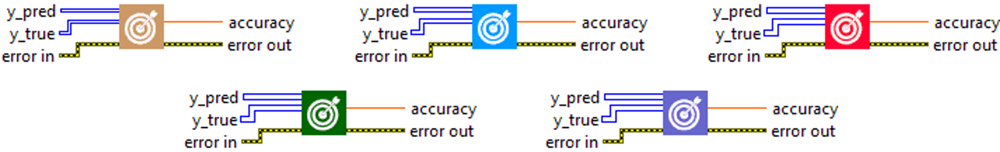 | Calculates how often predictions equal labels. |
| [BinaryAccuracy](https://haibal.com/documentation/metric-binary-accuracy/) | 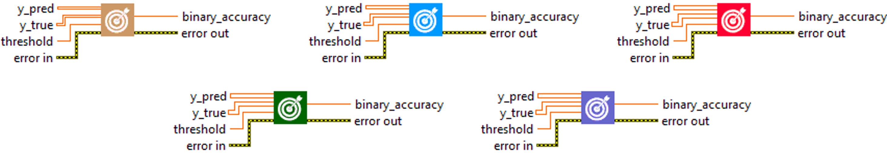 | Calculates how often predictions match binary labels. |
| [BinaryCrossentropy](https://haibal.com/documentation/metric-binary-crossentropy/) |  | Computes the crossentropy metric between the labels and predictions. |
| [BinaryIoU](https://haibal.com/documentation/metric-binary-iou/) | 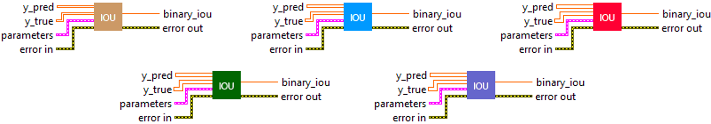 | Computes the Intersection-Over-Union metric for class 0 and/or 1. |
| [CategoricalAccuracy](https://haibal.com/documentation/metric-categorical-accuracy/) | 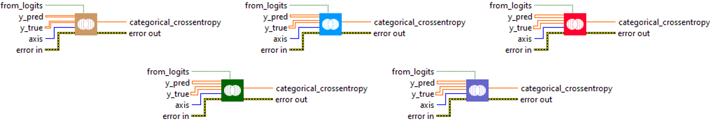 | Calculates how often predictions match one-hot labels. |
| [CategoricalCrossentropy](https://haibal.com/documentation/metric-categorical-crossentropy/) | 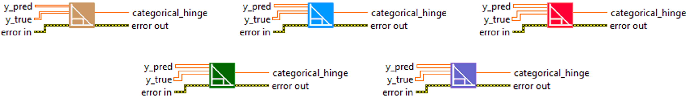 | Computes the crossentropy metric between the labels and predictions. |
| [CategoricalHinge](https://haibal.com/documentation/metric-categorical-hinge/) | 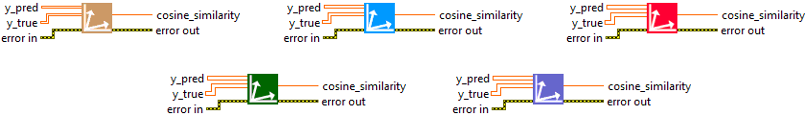 | Computes the categorical hinge metric between y_true and y_pred. |
| [CosineSimilarity](https://haibal.com/documentation/metric-cosine-similarity/) |  | Computes the cosine similarity between the labels and predictions. |
| [FalseNegatives](https://haibal.com/documentation/metric-false-negatives/) | 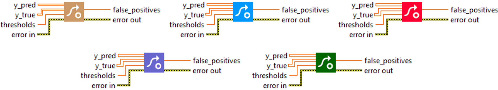 | Calculates the number of false negatives. |
| [FalsePositives](https://haibal.com/documentation/metric-false-positives/) |  | Calculates the number of false positives. |
| [Hinge](https://haibal.com/documentation/metric-hinge/) | 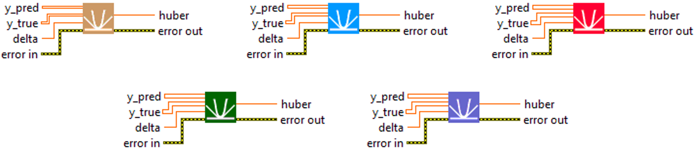 | Computes the hinge metric between y_true and y_pred. |
| [Huber](https://haibal.com/documentation/metric-huber/) |  | Computes the huber metrics between y_true and y_pred. |
| [IoU](https://haibal.com/documentation/metric-iou/) | 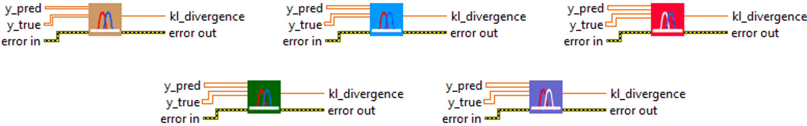 | Computes the Intersection-Over-Union metric for specific target classes. |
| [KLDivergence](https://haibal.com/documentation/metric-kl-divergence/) | 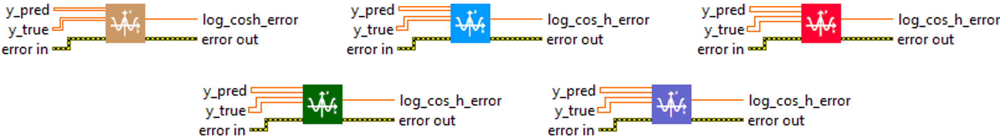 | Computes Kullback-Leibler divergence metric between y_true and y_pred. |
| [LogCoshError](https://haibal.com/documentation/metric-log-cosh-error/) | 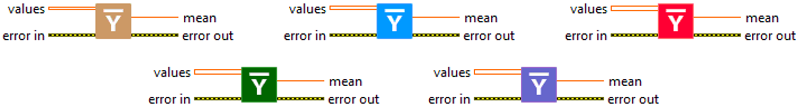 | Computes the logarithm of the hyperbolic cosine of the prediction error. |
| [Mean](https://haibal.com/documentation/metric-mean/) | 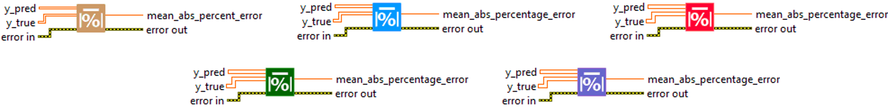 | Computes the mean of the given values. |
| [MeanAbsoluteError](https://haibal.com/documentation/metric-mean-absolute-error/) | 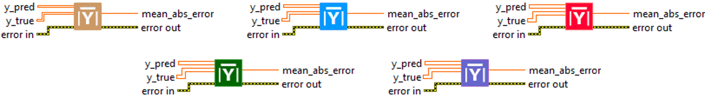 | Computes the mean absolute error between the labels and predictions. |
| [MeanAbsolutePercentageError](https://haibal.com/documentation/metric-mean-absolute-percentage-error/) |  | Computes the mean absolute percentage error between y_true and y_pred. |
| [MeanIoU](https://haibal.com/documentation/metric-mean-iou/) | 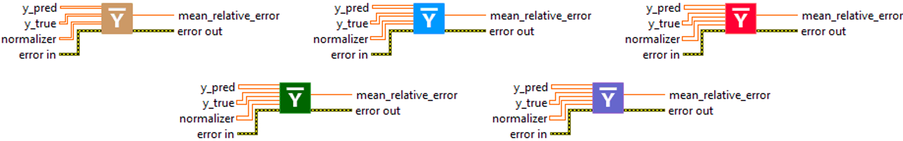 | Computes the mean Intersection-Over-Union metric. |
| [MeanRelativeError](https://haibal.com/documentation/metric-mean-relative-error/) | 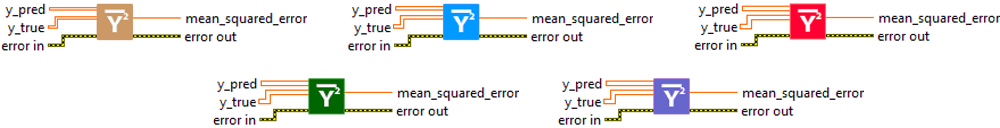 | Computes the mean relative error by normalizing with the given values. |
| [MeanSquaredError](https://haibal.com/documentation/metric-mean-squared-error/) |  | Computes the mean squared error between y_true and y_pred. |
| [MeanSquaredLogarithmicError](https://haibal.com/documentation/metric-mean-squared-logarithmic-error/) | 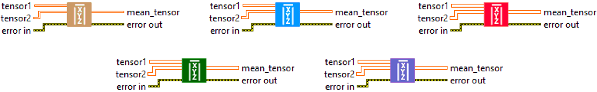 | Computes the mean squared logarithmic error between y_true and y_pred. |
| [MeanTensor](https://haibal.com/documentation/metric-mean-tensor/) | 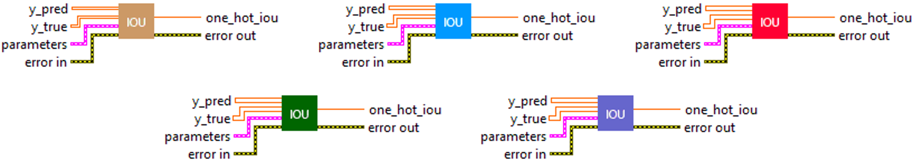 | Computes the element-wise mean of the given tensors. |
| [OneHotIoU](https://haibal.com/documentation/metric-one-hot-iou/) |  | Computes the Intersection-Over-Union metric for one-hot encoded labels. |
| [OneHotMeanIoU](https://haibal.com/documentation/metric-one-hot-mean-iou/) |  | Computes mean Intersection-Over-Union metric for one-hot encoded labels. |
| [Poisson](https://haibal.com/documentation/metric-poisson/) |  | Computes the poisson metric between y_true and y_pred. |
| [Precision](https://haibal.com/documentation/metric-precision/) | 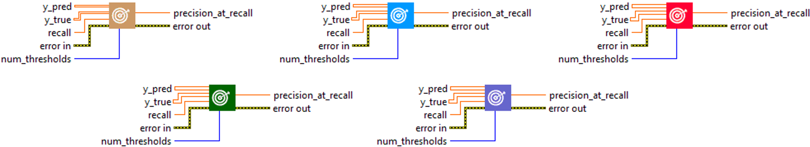 | Computes the precision of the predictions with respect to the labels. |
| [PrecisionAtRecall](https://haibal.com/documentation/metric-precision-at-recall/) |  | Computes best precision where recall is > specified value. |
| [Recall](https://haibal.com/documentation/metric-recall/) | 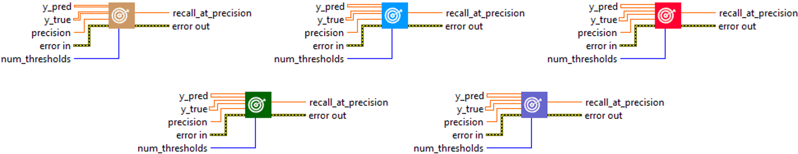 | Computes the recall of the predictions with respect to the labels. |
| [RecallAtPrecision](https://haibal.com/documentation/metric-recall-at-precision/) |  | Computes best recall where precision is > specified value. |
| [RootMeanSquaredError](https://haibal.com/documentation/metric-root-mean-squared-error/) |  | Computes root mean squared error metric between y_true and y_pred. |
| [SensitivityAtSpecificity](https://haibal.com/documentation/metric-sensitivity-at-specificity/) |  | Computes best sensitivity where specificity is > specified value. |
| [SparseCategoricalAccuracy](https://haibal.com/documentation/metric-sparse-categorical-accuracy/) |  | Calculates how often predictions match integer labels. |
| [SparseCategoricalCrossentropy](https://haibal.com/documentation/metric-sparse-categorical-crossentropy/) | 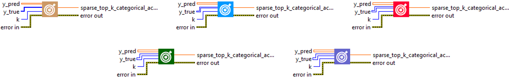 | Computes the crossentropy metric between the labels and predictions. |
| [SparseTopKCategoricalAccuracy](https://haibal.com/documentation/metric-sparse-top-k-categorical-accuracy/) | 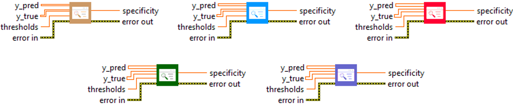 | Computes how often integer targets are in the top K predictions. |
| [Specificity](https://haibal.com/documentation/metric-specificity/) |  | Computes the specificity of the predictions with respect to the labels. |
| [SpecificityAtSensitivity](https://haibal.com/documentation/metric-specificity-at-sensitivity/) |  | Computes best specificity where sensitivity is > specified value. |
| [SquaredHinge](https://haibal.com/documentation/metric-squared-hinge/) |  | Computes the squared hinge metric between y_true and y_pred. |
| [Sum](https://haibal.com/documentation/metric-sum/) |  | Computes the sum of the given values. |
| [TopKCategoricalAccuracy](https://haibal.com/documentation/metric-top-k-categorical-accuracy/) |  | Computes how often targets are in the top K predictions. |
| [TrueNegatives](https://haibal.com/documentation/metric-true-negatives/) |  | Calculates the number of true negatives. |
| [TruePositives](https://haibal.com/documentation/metric-true-positives/) |  | Calculates the number of true positives. |
