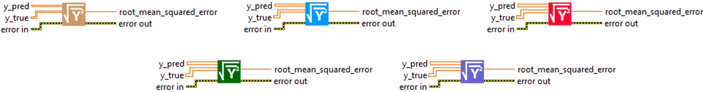
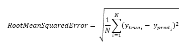
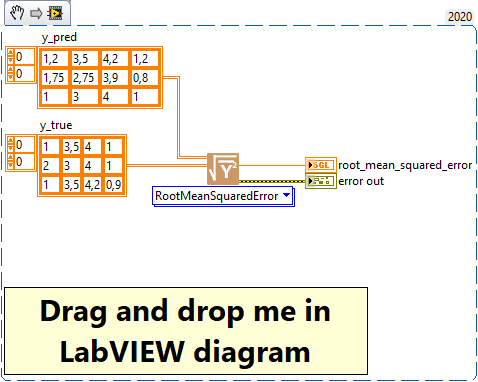

<h1>RootMeanSquaredError</h1>

<h2>Description</h2>

Computes root mean squared error metric between y_true and y_pred. Type : <em><strong>polymorphic</strong><strong>.</strong></em>

<h3>Input parameters</h3>

<table>
  <tbody>
    <tr>
      <td width="64" valign="top"></td>
      <td valign="top"><strong>y_pred : <em>array, </em></strong>predicted values.</td>
    </tr>
    <tr>
      <td width="64" valign="top"></td>
      <td valign="top"><strong>y_true : <em>array, </em></strong>true values.</td>
    </tr>
  </tbody>
</table>

<h3>Output parameters</h3>

<table>
  <tbody>
    <tr>
      <td width="64" valign="top"></td>
      <td valign="top"><strong>root_mean_squared_error : <em>float, </em></strong>result.</td>
    </tr>
  </tbody>
</table>

<h2>Use cases</h2>

The Root Mean Squared Error (RMSE) metric is commonly used in machine learning, particularly in regression tasks. It is useful for quantifying the error between values predicted by a model and actual values.

The RMSE is the square root of the mean of the squared errors. The smaller the RMSE, the better, as this means that the prediction error is smaller. One of the main reasons for using RMSE rather than Mean Squared Error (<a href="../meansquarederror-2/README.md">MSE</a>) is that RMSE is expressed in the same unit as the quantity you are trying to predict, making it more interpretable.

Here are a few specific areas where RMSE is used :

<ul>
<li>
<ul>
<li>Weather forecasting : RMSE is commonly used to assess the accuracy of weather forecasts, for example to evaluate the accuracy of temperature or precipitation forecasts.</li>
<li>Sales or demand forecasting : RMSE can be used to assess the accuracy of sales or demand forecasts in the field of supply chain planning.</li>
<li>Econometric model evaluation : in econometrics, RMSE is often used to compare the performance of different forecasting models.</li>
<li>Recommendation systems : in recommendation systems, RMSE can be used to assess the error between the scores predicted by the system and the scores actually given by users.</li>
</ul>
</li>
</ul>

<h2>Calculation</h2>

Root Mean Squared Error (RMSE) is a metric commonly used to measure the prediction error of a regression model. It is calculated by taking the square root of the mean of the squared differences between predicted values (y_pred) and actual values (y_true).A smaller RMSE value indicates a more accurate model fit.

This metric gives particular weight to larger errors, making it useful when large errors are particularly undesirable.

<h2>Example</h2>

All these exemples are snippets PNG, you can drop these Snippet onto the block diagram and get the depicted code added to your VI (Do not forget to install Deep Learning library to run it).

<h3>Easy to use</h3>

