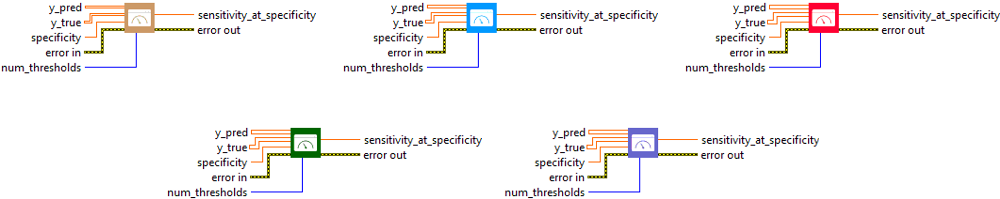

<h1>SensitivityAtSpecificity</h1>

<h2>Description</h2>

Computes best sensitivity where specificity is &gt; specified value. Type : <em><strong>polymorphic</strong><strong>.</strong></em>

<h3>Input parameters</h3>

<table>
  <tbody>
    <tr>
      <td width="64" valign="top"></td>
      <td valign="top"><strong>y_pred : <em>array, </em></strong>predicted values.</td>
    </tr>
    <tr>
      <td width="64" valign="top"></td>
      <td valign="top"><strong>y_true : <em>array, </em></strong>true values.</td>
    </tr>
    <tr>
      <td width="64" valign="top"></td>
      <td valign="top"><strong> specificity : <em>float,</em></strong> a scalar value in range [0 ,1].</td>
    </tr>
    <tr>
      <td width="64" valign="top"></td>
      <td valign="top"><strong>num_thresholds</strong><em><strong> : integer</strong><strong>,</strong></em> the number of thresholds to use for matching the given recall.</td>
    </tr>
  </tbody>
</table>

<h3>Output parameters</h3>

<table>
  <tbody>
    <tr>
      <td width="64" valign="top"></td>
      <td valign="top"><strong>sensitivity_at_specificity : <em>float, </em></strong>result.</td>
    </tr>
  </tbody>
</table>

<h2>Use cases</h2>

The Sensitivity at Specificity metric is mainly used in binary classification tasks, particularly in the medical field, where it is particularly relevant.

Here are a few specific areas where it is used :

<ul>
<li>
<ul>
<li>Medical : Sensitivity at Specificity is used to evaluate the performance of diagnostic tests.</li>
<li>Other fields of application : This metric may also be relevant in other fields of application where it is important to balance the rate of false positives and true positives, such as fraud detection or anomaly detection.</li>
</ul>
</li>
</ul>

<h2>Calculation</h2>

The SensitivityAtSpecificity metric is used to evaluate the performance of classification models. It calculates sensitivity, which is the ratio of true positives to the sum of true positives and false negatives, at a specified level of specificity. Specificity is the ratio of true negatives to the sum of true negatives and false positives. To calculate this metric, a number of thresholds (num_thresholds) are used. For each threshold, calculated as i / (num_thresholds – 1) where i ranges from 0 to num_thresholds, sensitivity and specificity are calculated. Then, when the specificity reaches or exceeds the specified value, the highest sensitivity obtained among all the thresholds is used.

This metric offers a balance between sensitivity and specificity.

<table>
  <tbody>
    <tr>
      <td valign="top" width="50%">

</td>
      <td valign="top" width="50%">

</td>
    </tr>
  </tbody>
</table>

<h2>Example</h2>

All these exemples are snippets PNG, you can drop these Snippet onto the block diagram and get the depicted code added to your VI (Do not forget to install Deep Learning library to run it).

<h3>Easy to use</h3>

