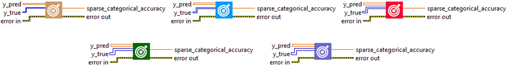
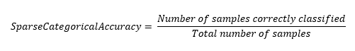

<h1>SparseCategoricalAccuracy</h1>

<h2>Description</h2>

Calculates how often predictions match integer labels. Type : <em><strong>polymorphic</strong><strong>.</strong></em>

<h3>Input parameters</h3>

<table>
  <tbody>
    <tr>
      <td width="64" valign="top"></td>
      <td valign="top"><strong>y_pred : <em>array, </em></strong>predicted values (one hot logits for example, [0.1, 0.8, 0.9] for 3-class problem).</td>
    </tr>
    <tr>
      <td width="64" valign="top"></td>
      <td valign="top"><strong>y_true : <em>array, </em></strong>true values.</td>
    </tr>
  </tbody>
</table>

<h3>Output parameters</h3>

<table>
  <tbody>
    <tr>
      <td width="64" valign="top"></td>
      <td valign="top"><strong>sparse_categorical_accuracy : <em>float, </em></strong>result.</td>
    </tr>
  </tbody>
</table>

<h2>Use cases</h2>

The SparseCategoricalAccuracy metric is commonly used in machine learning, particularly in multiclass classification problems. It is often used when class labels are provided as integers instead of one-hot vectors.

Here are some examples of specific domains where SparseCategoricalAccuracy can be used :

<ul>
<li>
<ul>
<li>Image recognition : in image recognition problems where there are more than two image categories to predict, SparseCategoricalAccuracy is often used. For example, if you have a model that predicts whether an image is a cat, a dog or a horse, you could use SparseCategoricalAccuracy to measure the accuracy of your model.</li>
<li>Natural Language Processing (NLP) : SparseCategoricalAccuracy is also commonly used in NLP tasks, such as text classification, where class labels are often provided as integers.</li>
<li>Recommender systems : in recommender systems, SparseCategoricalAccuracy can be used to assess the accuracy of classification predictions.</li>
</ul>
</li>
</ul>

<h2>Calculation</h2>

SparseCategoricalAccuracy is a metric that evaluates the performance of multiclass classification models. It compares true labels (y_true), which are in the form of integers (0,1,…, nb_classes), with the model’s most probable predictions (y_pred), which are in the form of one-hot vectors.  The most probable prediction is identified by taking the index of the maximum value in the one-hot vector. If the index corresponds to the true label, then the prediction is considered correct.  The metric is then calculated as the proportion of correct predictions out of the total set of predictions.

<h2>Example</h2>

All these exemples are snippets PNG, you can drop these Snippet onto the block diagram and get the depicted code added to your VI (Do not forget to install Deep Learning library to run it).

<h3>Easy to use</h3>

