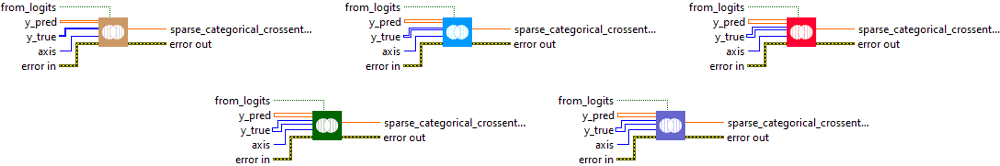
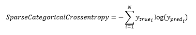
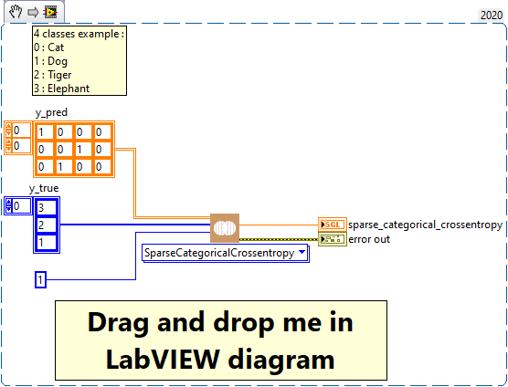

<h1>SparseCategoricalCrossentropy</h1>

<h2>Description</h2>

Computes the crossentropy metric between the labels and predictions. Type : <em><strong>polymorphic</strong><strong>.</strong></em>

<h3>Input parameters</h3>

<table>
  <tbody>
    <tr>
      <td width="64" valign="top"></td>
      <td valign="top"><strong>y_pred : <em>array, </em></strong>predicted values (if from_logits = true then one hot logits for example, [0.1, 0.8, 0.9] else one hot probabilities for example, [0.1, 0.3, 0.6] for 3-class problem).</td>
    </tr>
    <tr>
      <td width="64" valign="top"></td>
      <td valign="top"><strong>y_true : <em>array, </em></strong>true values.</td>
    </tr>
    <tr>
      <td width="64" valign="top"></td>
      <td valign="top"><strong> from_logits : <em>boolean,</em></strong> whether output is expected to be a logits tensor.</td>
    </tr>
    <tr>
      <td width="64" valign="top"></td>
      <td valign="top"><strong>axis : <em>integer,</em></strong> the dimension along which entropy is computed.</td>
    </tr>
  </tbody>
</table>

<h3>Output parameters</h3>

<table>
  <tbody>
    <tr>
      <td width="64" valign="top"></td>
      <td valign="top"><strong>sparse_categorical_crossentropy : <em>float, </em></strong>result.</td>
    </tr>
  </tbody>
</table>

<h2>Use cases</h2>

The SparseCategoricalCrossentropy metric is commonly used in machine learning, specifically in multiclass classification problems where the labels are integers, not one-hot vectors. It is often used as a loss function to train models, as it measures the distance between the probability distribution predicted by the model and the actual probability distribution.

Here are some examples of specific areas where SparseCategoricalCrossentropy can be used :

<ul>
<li>
<ul>
<li>Image recognition : in image recognition problems where there are more than two image categories to predict, SparseCategoricalCrossentropy is often used. For example, in a problem where you’re trying to predict whether an image is a cat, a dog, or a horse, you could use SparseCategoricalCrossentropy as a loss function to train your model.</li>
<li>Natural Language Processing (NLP) : SparseCategoricalCrossentropy is also commonly used in NLP tasks, such as text classification, where class labels are often provided as integers.</li>
<li>Recommender systems : in recommender systems, SparseCategoricalCrossentropy can be used to train models that predict the ranking of various items.</li>
</ul>
</li>
</ul>

<h2>Calculation</h2>

Use this crossentropy metric when there are two or more label classes. We expect labels to be provided as integers. If you want to provide labels using one-hot representation, please use <a href="../categoricalcrossentropy-2/README.md">CategoricalCrossentropy</a> metric.

<h2>Example</h2>

All these exemples are snippets PNG, you can drop these Snippet onto the block diagram and get the depicted code added to your VI (Do not forget to install Deep Learning library to run it).

<h3>Easy to use</h3>

