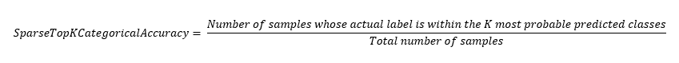

<h1>SparseTopKCategoricalAccuracy</h1>

<h2>Description</h2>

Computes how often integer targets are in the top K predictions. Type : <em><strong>polymorphic</strong><strong>.</strong></em>

<h3>Input parameters</h3>

<table>
  <tbody>
    <tr>
      <td width="64" valign="top"></td>
      <td valign="top"><strong>y_pred : <em>array, </em></strong>predicted values (one hot logits for example, [0.1, 0.8, 0.9] for 3-class problem).</td>
    </tr>
    <tr>
      <td width="64" valign="top"></td>
      <td valign="top"><strong>y_true : <em>array, </em></strong>true values.</td>
    </tr>
    <tr>
      <td width="64" valign="top"></td>
      <td valign="top"><strong>k : <em>integer,</em></strong> number of top elements to look at for computing accuracy.</td>
    </tr>
  </tbody>
</table>

<h3>Output parameters</h3>

<table>
  <tbody>
    <tr>
      <td width="64" valign="top"></td>
      <td valign="top"><strong>sparse_top_k_categorical_accuracy : <em>float, </em></strong>result.</td>
    </tr>
  </tbody>
</table>

<h2>Use cases</h2>

The SparseTopKCategoricalAccuracy metric is mainly used in machine learning, specifically in multiclass classification tasks. It is useful in situations where you are interested not only in the most likely prediction (Top-1), but also in the k most likely predictions (Top-k).

Here are some examples of specific areas where SparseTopKCategoricalAccuracy can be used :

<ul>
<li>
<ul>
<li>Image recognition : in image classification tasks, SparseTopKCategoricalAccuracy is often used to evaluate the performance of a model. For example, in a model that attempts to classify images into different categories, SparseTopKCategoricalAccuracy could be used to see if the ground truth lies in the k most likely class predictions.</li>
<li>Natural Language Processing (NLP) : SparseTopKCategoricalAccuracy is also used in NLP tasks, such as text classification, where class labels are often provided as integers. In machine translation or text generation, for example, it is often useful to look at the k best predictions.</li>
<li>Information retrieval : in the field of information retrieval, SparseTopKCategoricalAccuracy can be used to assess the quality of recommendation systems or search engines, by checking whether the item searched for is among the k best recommendations or search results.</li>
</ul>
</li>
</ul>

<h2>Calculation</h2>

SparseTopKCategoricalAccuracy is a metric used to evaluate the performance of multiclass classification models where the labels are integers (0, 1, …, nb_classes). It compares the true labels (y_true) with the K most probable predictions of the model (y_pred), which are generally obtained via a softmax at the output of the model. If the true label is among the K most probable predictions, the prediction is considered correct. The metric is then calculated as the proportion of correct predictions out of the total set of predictions.

The parameter K is generally chosen according to the problem to be solved, and allows alternative model predictions to be taken into account.

<h2>Example</h2>

All these exemples are snippets PNG, you can drop these Snippet onto the block diagram and get the depicted code added to your VI (Do not forget to install Deep Learning library to run it).

<h3>Easy to use</h3>

