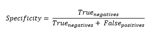

<h1>Specificity</h1>

<h2>Description</h2>

Computes the specificity of the predictions with respect to the labels. Type : <em><strong>polymorphic</strong><strong>.</strong></em>

<h3>Input parameters</h3>

<table>
  <tbody>
    <tr>
      <td width="64" valign="top"></td>
      <td valign="top"><strong>y_pred : <em>array, </em></strong>predicted values.</td>
    </tr>
    <tr>
      <td width="64" valign="top"></td>
      <td valign="top"><strong>y_true : <em>array, </em></strong>true values.</td>
    </tr>
    <tr>
      <td width="64" valign="top"></td>
      <td valign="top"><strong> thresholds : <em>float,</em></strong> representing the threshold for deciding whether prediction and true values are 1 or 0 (above the threshold is true, below is false).</td>
    </tr>
  </tbody>
</table>

<h3>Output parameters</h3>

<table>
  <tbody>
    <tr>
      <td width="64" valign="top"></td>
      <td valign="top"><strong>specificity : <em>float, </em></strong>result.</td>
    </tr>
  </tbody>
</table>

<h2>Use cases</h2>

The “Specificity” metric, is commonly used in machine learning, particularly in binary classification problems. Specificity measures the proportion of true negatives that are correctly identified.

Here are a few application areas where specificity is used :

<ul>
<li>
<ul>
<li>Medical field : in medical diagnostic tests, specificity is often used to assess a test’s ability to correctly identify individuals who do not have a specific condition. For example, a breast cancer screening test must be able to correctly identify women who do not have breast cancer (i.e., achieve a high specificity score) to avoid giving a false-positive diagnosis.</li>
<li>Anomaly detection : in anomaly detection, a system must be able to correctly identify normal findings while detecting anomalies. High specificity indicates that the system is good at avoiding false positives.</li>
<li>Fraud detection systems : in this context, specificity is important because the costs associated with incorrectly classifying a non-fraudulent transaction (false positive) can be high. Models are therefore often designed to maximize specificity, while maintaining an acceptable fraud detection rate.</li>
<li>Spam filtering systems : in this case, high specificity means that legitimate messages (true negatives) are not classified as spam (false positives).</li>
</ul>
</li>
</ul>

<h2>Calculation</h2>

Specificity is an important metric for evaluating classification models. It is calculated by dividing the number of true negatives (TN) by the sum of true negatives and false positives (FP), i.e. TN / (TN + FP). True negatives are cases where the model correctly predicts the negative class, while false positives are cases where the model incorrectly predicts the positive class when it is in fact the negative class. A high specificity indicates that the model is good at detecting true negatives, but does not take into account its accuracy in predicting the negative class.

<h2>Example</h2>

All these exemples are snippets PNG, you can drop these Snippet onto the block diagram and get the depicted code added to your VI (Do not forget to install Deep Learning library to run it).

<h3>Easy to use</h3>

