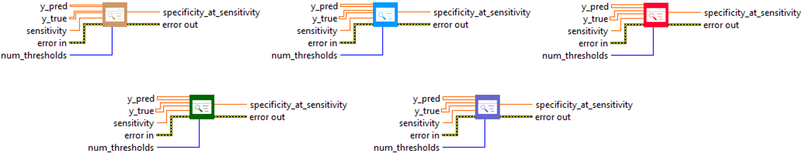
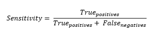

<h1>SpecificityAtSensitivity</h1>

<h2>Description</h2>

Computes best specificity where sensitivity is &gt; specified value. Type : <em><strong>polymorphic</strong><strong>.</strong></em>

<h3>Input parameters</h3>

<table>
  <tbody>
    <tr>
      <td width="64" valign="top"></td>
      <td valign="top"><strong>y_pred : <em>array, </em></strong>predicted values.</td>
    </tr>
    <tr>
      <td width="64" valign="top"></td>
      <td valign="top"><strong>y_true : <em>array, </em></strong>true values.</td>
    </tr>
    <tr>
      <td width="64" valign="top"></td>
      <td valign="top"><strong> sensitivity : <em>float,</em></strong> a scalar value in range [0 ,1].</td>
    </tr>
    <tr>
      <td width="64" valign="top"></td>
      <td valign="top"><strong>num_thresholds</strong><em><strong> : integer</strong><strong>,</strong></em> the number of thresholds to use for matching the given recall.</td>
    </tr>
  </tbody>
</table>

<h3>Output parameters</h3>

<table>
  <tbody>
    <tr>
      <td width="64" valign="top"></td>
      <td valign="top"><strong>specificity</strong><strong>_at_sensitivity : <em>float, </em></strong>result.</td>
    </tr>
  </tbody>
</table>

<h2>Calculation</h2>

The SpecificityAtSensitivity metric is used to evaluate the performance of classification models. It calculates specificity, i.e. the ratio of true negatives to the sum of true negatives and false positives, at a specified sensitivity level. Sensitivity is the ratio of true positives to the sum of true positives and false negatives. To calculate this metric, a number of thresholds (num_thresholds) are used. For each threshold, calculated as i / (num_thresholds – 1) where i ranges from 0 to num_thresholds, specificity and sensitivity are calculated. Then, when sensitivity reaches or exceeds the specified value (sensitivity), the highest specificity obtained among all the thresholds is retained.

This metric offers a balance between specificity and sensitivity.

<table>
  <tbody>
    <tr>
      <td valign="top" width="50%">

</td>
      <td valign="top" width="50%">

</td>
    </tr>
  </tbody>
</table>

<h2>Example</h2>

All these exemples are snippets PNG, you can drop these Snippet onto the block diagram and get the depicted code added to your VI (Do not forget to install Deep Learning library to run it).

<h3>Easy to use</h3>

