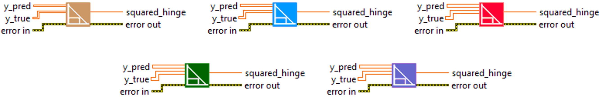
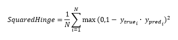

<h1>SquaredHinge</h1>

<h2>Description</h2>

Computes the squared hinge metric between y_true and y_pred. Type : <em><strong>polymorphic</strong><strong>.</strong></em>

<h3>Input parameters</h3>

<table>
  <tbody>
    <tr>
      <td width="64" valign="top"></td>
      <td valign="top"><strong>y_pred : <em>array, </em></strong>predicted values.</td>
    </tr>
    <tr>
      <td width="64" valign="top"></td>
      <td valign="top"><strong>y_true : <em>array, </em></strong>true values are expected to be -1 or 1. If binary (0 or 1) labels are provided we will convert them to -1 or 1.</td>
    </tr>
  </tbody>
</table>

<h3>Output parameters</h3>

<table>
  <tbody>
    <tr>
      <td width="64" valign="top"></td>
      <td valign="top"><strong>squared_hinge : <em>float, </em></strong>result.</td>
    </tr>
  </tbody>
</table>

<h2>Use cases</h2>

The “SquaredHinge” metric is commonly used in the field of machine learning, more specifically in classification tasks. It is a variant of “Hinge Loss”, which is often used with Support Vector Machines (SVM), a popular technique for classification tasks.

SquaredHinge” squares the margin loss, further punishing prediction errors. It is particularly useful when you want to give greater weight to larger errors.

Here are a few examples of specific areas where the SquaredHinge can be used :

<ul>
<li>
<ul>
<li>Image recognition : in image classification tasks, “SquaredHinge” can be used to train an SVM model to distinguish between different image categories.</li>
<li>Anomaly detection : support vector machines are often used in anomaly detection tasks, and the use of “SquaredHinge” can help to put more emphasis on observations that are far from the decision frontier.</li>
<li>Text classification : SVMs are also commonly used in text classification tasks, such as spam detection or sentiment analysis, where SquaredHinge can be used as a loss function.</li>
</ul>
</li>
</ul>

<h2>Calculation</h2>

The SquaredHinge metric is mainly used in binary classification tasks where y_true values are expected to be -1 or 1. If binary labels (0 or 1) are provided, they will be converted to -1 or 1.  It calculates the squared hinge loss, which is defined as the maximum between 0 and 1 minus the product of the true label and the prediction.

This function penalizes incorrect predictions more heavily than the standard hinge loss, which is why it is often used when prediction accuracy is particularly important.

<h2>Example</h2>

All these exemples are snippets PNG, you can drop these Snippet onto the block diagram and get the depicted code added to your VI (Do not forget to install Deap Learning library to run it).

<h3>Easy to use</h3>

