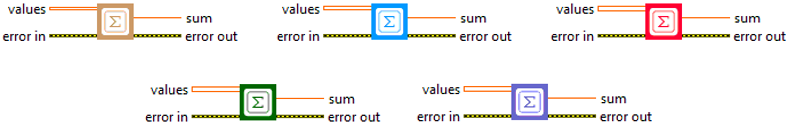
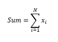

<h1>Sum</h1>

<h2>Description</h2>

Computes the sum of the given values. Type : <em><strong>polymorphic</strong><strong>.</strong></em>

<h3>Input parameters</h3>

<table>
  <tbody>
    <tr>
      <td width="64" valign="top"></td>
      <td valign="top"><strong>values : <em>array, </em></strong>values that will be added together.</td>
    </tr>
  </tbody>
</table>

<h3>Output parameters</h3>

<table>
  <tbody>
    <tr>
      <td width="64" valign="top"></td>
      <td valign="top"><strong>sum : <em>float, </em></strong>result.</td>
    </tr>
  </tbody>
</table>

<h2>Use cases</h2>

The “Sum” metric is a basic function widely used in many fields and is not limited to a machine learning context. It is often used to add elements of a series, array or other data structure. In general, the “Sum” metric is used wherever you need to add up values, whether to calculate totals, aggregations, or in more complex mathematical calculations.

However, in the context of machine learning, sum can be used in a number of different ways :

<ul>
<li>
<ul>
<li>Loss function : in some machine learning methods, the loss function is defined as the sum of the individual errors for each example in the training dataset.</li>
<li>Prediction aggregation : in ensemble techniques such as bagging or boosting, predictions from several models are often combined (e.g. summed) to obtain a final prediction.</li>
<li>Gradient descent : the sum of derivatives (or gradients) is often calculated when optimizing machine learning models.</li>
<li>Natural language processing : the sum of word vectors is often used to obtain a vector representation of a sentence or document.</li>
</ul>
</li>
</ul>

It’s important to note that although the sum is a simple operation, its use depends largely on the specific context and data to be processed.

<h2>Calculation</h2>

The Sum metric is a simple but useful reduction operation that adds up all the elements of an array. Whether the array is one-dimensional, two-dimensional or more, the Sum metric traverses each element and adds it to a cumulative total. The result is the global sum of all values in the array. This metric is often used in data analysis to aggregate information or calculate cumulative totals.

<h2>Example</h2>

All these exemples are snippets PNG, you can drop these Snippet onto the block diagram and get the depicted code added to your VI (Do not forget to install Deep Learning library to run it).

<h3>Easy to use</h3>

