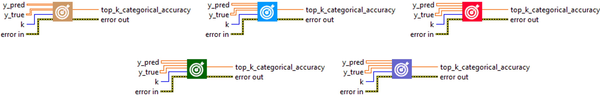
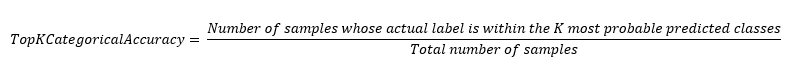

<h1>TopKCategoricalAccuracy</h1>

<h2>Description</h2>

Computes how often targets are in the top K predictions. Type : <em><strong>polymorphic</strong><strong>.</strong></em>

<h3>Input parameters</h3>

<table>
  <tbody>
    <tr>
      <td width="64" valign="top"></td>
      <td valign="top"><strong>y_pred : <em>array, </em></strong>predicted values (one hot logits for example, [0.1, 0.8, 0.9] or one hot probabilities for example, [0.1, 0.3, 0.6] for 3-class problem).</td>
    </tr>
    <tr>
      <td width="64" valign="top"></td>
      <td valign="top"><strong>y_true : <em>array, </em></strong>true values (one hot encoding for example, [0, 0, 1] for 3-class problem).</td>
    </tr>
    <tr>
      <td width="64" valign="top"></td>
      <td valign="top"><strong>k : <em>integer,</em></strong> number of top elements to look at for computing accuracy.</td>
    </tr>
  </tbody>
</table>

<h3>Output parameters</h3>

<table>
  <tbody>
    <tr>
      <td width="64" valign="top"></td>
      <td valign="top"><strong>top_k_categorical_accuracy : <em>float, </em></strong>result.</td>
    </tr>
  </tbody>
</table>

<h2>Use cases</h2>

The “TopKCategoricalAccuracy” metric is generally used in multi-class classification problems in machine learning. It is particularly useful when you want to know whether the true class is among the ‘K’ best (most likely) predictions of the model, rather than simply the most likely class.

Here are some examples of specific areas where “TopKCategoricalAccuracy” can be used :

<ul>
<li>
<ul>
<li>Image recognition : in image recognition competitions such as ImageNet, which have a large number of classes, top-5 accuracy is often used as a metric. In this context, a model is considered to have correctly classified an image if the true class is among its top-5 predictions.</li>
<li>Information retrieval / Recommender systems : in these fields, we are often interested in knowing whether the relevant item (e.g. a document or a product) is among the ‘K’ first results or recommendations of the system.</li>
<li>Natural language processing : in some NLP tasks, such as next word prediction, top-K accuracy can be used to assess whether the true next word is among the ‘K’ best predictions of the model.</li>
</ul>
</li>
</ul>

<h2>Calculation</h2>

The TopKCategoricalAccuracy metric is used to evaluate the performance of multiclass classification models. It compares true labels (y_true), which are usually one-hot encoded, with the K most probable model predictions (y_pred). Model predictions are generally obtained via a softmax at the model output. If the true label is among the K most probable predictions, the prediction is considered correct. The metric is then calculated as the proportion of correct predictions out of the total set of predictions. The parameter K is generally chosen according to the problem to be solved, and allows alternative model predictions to be taken into account.

<h2>Example</h2>

All these exemples are snippets PNG, you can drop these Snippet onto the block diagram and get the depicted code added to your VI (Do not forget to install Deep Learning library to run it).

<h3>Easy to use</h3>

