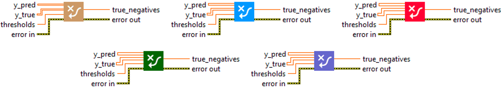
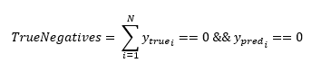

<h1>TrueNegatives</h1>

<h2>Description</h2>

Calculates the number of true negatives. Type : <em><strong>polymorphic</strong><strong>.</strong></em>

<h3>Input parameters</h3>

<table>
  <tbody>
    <tr>
      <td width="64" valign="top"></td>
      <td valign="top"><strong>y_pred : <em>array, </em></strong>predicted values (logits values).</td>
    </tr>
    <tr>
      <td width="64" valign="top"></td>
      <td valign="top"><strong>y_true : <em>array, </em></strong>true values (logits values, or binary values if the threshold value is between 0 and 1).</td>
    </tr>
    <tr>
      <td width="64" valign="top"></td>
      <td valign="top"><strong> thresholds : <em>float,</em></strong> representing the threshold for deciding whether prediction and true values are 1 or 0 (above the threshold is true, below is false).</td>
    </tr>
  </tbody>
</table>

<h3>Output parameters</h3>

<table>
  <tbody>
    <tr>
      <td width="64" valign="top"></td>
      <td valign="top"><strong>true_negatives : <em>float, </em></strong>result.</td>
    </tr>
  </tbody>
</table>

<h2>Use cases</h2>

The “TrueNegatives” metric is commonly used in machine learning, particularly for binary classification tasks. This metric counts the number of true negatives, i.e. the number of samples that have been correctly classified as negative by the model.

Here are some examples of specific areas where “TrueNegatives” can be used :

<ul>
<li>
<ul>
<li>Spam detection : as mentioned above, in spam detection, true negatives are correctly identified non-spam emails.</li>
<li>Medical diagnosis : in disease classification, a true negative would be a healthy patient correctly identified as such.</li>
<li>Fraud detection : in the financial field, a true negative would be a non-fraudulent transaction that has been correctly identified as such.</li>
</ul>
</li>
</ul>

<h2>Calculation</h2>

“TrueNegatives” metric is used in the context of binary classification.

A “True Negative” (TN) occurs when a model correctly predicts the negative class for an example that is actually of the negative class. In other words, the model predicted that the event would not occur, and it did not.

<table>
  <tbody>
    <tr>
      <td valign="top" width="62%">

</td>
      <td valign="top" width="38%">

</td>
    </tr>
  </tbody>
</table>

<h2>Example</h2>

All these exemples are snippets PNG, you can drop these Snippet onto the block diagram and get the depicted code added to your VI (Do not forget to install Deep Learning library to run it).

<h3>Easy to use</h3>

