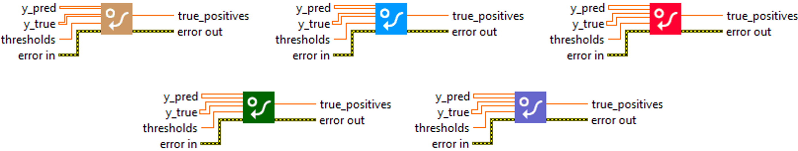
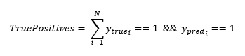

<h1>FalsePositives</h1>

<h2>Description</h2>

Calculates the number of true positives. Type : <em><strong>polymorphic</strong><strong>.</strong></em>

<h3>Input parameters</h3>

<table>
  <tbody>
    <tr>
      <td width="64" valign="top"></td>
      <td valign="top"><strong>y_pred : <em>array, </em></strong>predicted values (logits values).</td>
    </tr>
    <tr>
      <td width="64" valign="top"></td>
      <td valign="top"><strong>y_true : <em>array, </em></strong>true values (logits values, or binary values if the threshold value is between 0 and 1).</td>
    </tr>
    <tr>
      <td width="64" valign="top"></td>
      <td valign="top"><strong> thresholds : <em>float,</em></strong> representing the threshold for deciding whether prediction and true values are 1 or 0 (above the threshold is true, below is false).</td>
    </tr>
  </tbody>
</table>

<h3>Output parameters</h3>

<table>
  <tbody>
    <tr>
      <td width="64" valign="top"></td>
      <td valign="top"><strong>true_positives : <em>float, </em></strong>result.</td>
    </tr>
  </tbody>
</table>

<h2>Use cases</h2>

The “TruePositives” metric is widely used in machine learning, particularly in binary and multi-label classification tasks. A “true positive” occurs when the model correctly predicts that an example belongs to the positive class.

Here are a few examples of areas where the “TruePositives” metric is used :

<ul>
<li>
<ul>
<li>Spam filtering : an email is spam and the model correctly predicts it as spam.</li>
<li>Medical diagnosis : a patient has a certain disease and the model correctly predicts that the patient has this disease.</li>
<li>Fraud detection : a transaction is fraudulent and the model correctly predicts that it is fraudulent.</li>
<li>Object recognition in images : a specific object is present in an image and the model correctly predicts that this object is present.</li>
</ul>
</li>
</ul>

<h2>Calculation</h2>

“TruePositives” is a metric used in binary classification.

A “True Positive” (TP) occurs when a model correctly predicts the positive class for an example that is actually of the positive class. In other words, the model predicted that the event would occur, and it did.

<table>
  <tbody>
    <tr>
      <td valign="top" width="62%">

</td>
      <td valign="top" width="38%">

</td>
    </tr>
  </tbody>
</table>

<h2>Example</h2>

All these exemples are snippets PNG, you can drop these Snippet onto the block diagram and get the depicted code added to your VI (Do not forget to install Deep Learning library to run it).

<h3>Easy to use</h3>

