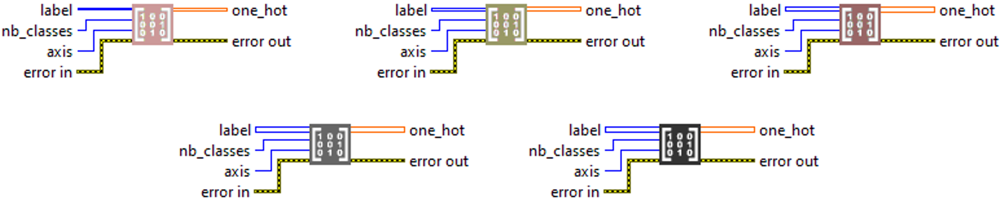

<h1>Categorical To OneHot</h1>

<h2>Description</h2>

Converts categories into one-hot encoded vectors for machine learning. Type : <em><strong>polymorphic</strong><strong>.</strong></em>

<h3>Input parameters</h3>

<table>
  <tbody>
    <tr>
      <td width="64" valign="top"></td>
      <td valign="top"><strong>label : <em>array, </em></strong>an array or tensor of integer indices representing the class of each sample. If <code>label</code> has dimension <code>n</code>, the output will have dimension <code>n+1</code> because a new axis is added for the one‑hot representation.</td>
    </tr>
    <tr>
      <td width="64" valign="top"></td>
      <td valign="top"><strong>nb_classes : <em>integer, </em></strong>total number of classes. Defines the size of the new axis added for the one‑hot encoding (example : if <code>nb_classes = 5</code>, the new axis will have size 5).</td>
    </tr>
    <tr>
      <td width="64" valign="top"></td>
      <td valign="top"><strong>axis : <em>integer,  </em></strong>position at which to insert the new axis in the tensor. The value of <code>axis</code> must be between <code>0</code> and <code>n</code> (where <code>n</code> is the rank of <code>label</code>).
<ul>
<li>
<ul>
<li><code>axis = n</code> → adds the new dimension at the end.</li>
<li><code>axis = 0</code> → adds the new dimension at the beginning.</li>
</ul>
</li>
</ul></td>
    </tr>
  </tbody>
</table>

<h3>Output parameters</h3>

<table>
  <tbody>
    <tr>
      <td width="64" valign="top"></td>
      <td valign="top"><strong>one_hot : <em>array, </em></strong>the resulting one‑hot tensor, obtained by inserting an axis of size <code>nb_classes</code> at the specified <code>axis</code> position. Each index in <code>label</code> is converted to a one‑hot vector of length <code>nb_classes</code>.</td>
    </tr>
  </tbody>
</table>

<h2>Use cases</h2>

The one-hot transformation function is used to convert categorical data (such as class names or types) into binary vectors. Each category is represented by a vector containing a single “1” and “0”s elsewhere. This representation allows machine learning and deep learning algorithms to properly handle non-numeric data without introducing any ordinal relationship between categories.

<h2>Example</h2>

All these exemples are snippets PNG, you can drop these Snippet onto the block diagram and get the depicted code added to your VI (Do not forget to install Deep Learning library to run it).

