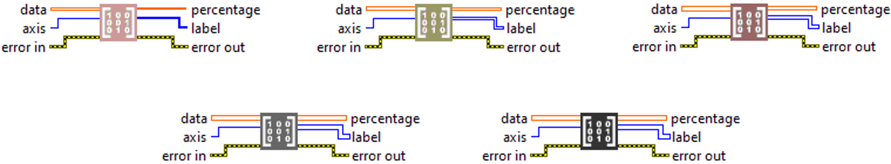

<h1>OneHot To Categorical</h1>

<h2>Description</h2>

Converts one-hot vectors back to categorical values. Type : <em><strong>polymorphic</strong><strong>.</strong></em>

<h3>Input parameters</h3>

<table>
  <tbody>
    <tr>
      <td width="64" valign="top"></td>
      <td valign="top"><strong>data : <em>array, </em></strong>a tensor containing one‑hot encoded data or class probabilities along one axis. The size of the axis specified in <code>axis</code> corresponds to the number of classes.</td>
    </tr>
    <tr>
      <td width="64" valign="top"></td>
      <td valign="top"><strong>axis : <em>integer,  </em></strong>the axis along which the class dimension is located. The function will search for the index of the maximum value along this axis to determine the categorical label.
<ul>
<li> </li>
</ul></td>
    </tr>
  </tbody>
</table>

<h3>Output parameters</h3>

<table>
  <tbody>
    <tr>
      <td width="64" valign="top"></td>
      <td valign="top"><strong>percentage : <em>array, </em></strong>tensor containing the maximum value along the specified axis for each element (e.g. the confidence or probability of the predicted class).</td>
    </tr>
    <tr>
      <td width="64" valign="top"></td>
      <td valign="top"><strong>label : <em>array, </em></strong>tensor of integer class indices obtained by taking the argmax along the specified axis. This is the categorical label corresponding to the one‑hot encoding.</td>
    </tr>
  </tbody>
</table>

<h2>Use cases</h2>

The one-hot to categorical function is used to convert a one-hot encoded vector back into its original categorical label. This is useful during post-processing, for example, to interpret the output of a classification model and display the predicted class name or index.

<h2>Example</h2>

All these exemples are snippets PNG, you can drop these Snippet onto the block diagram and get the depicted code added to your VI (Do not forget to install Deep Learning library to run it).

