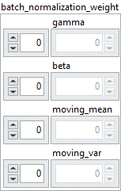

<h1>BatchNormalization</h1>

<h2>Description</h2>

Defines the weights of the BatchNormalization layer selected by the index. Type : <em><strong>polymorphic</strong><strong>.</strong></em>

<h3>Input parameters</h3>

<table>
  <tbody>
    <tr>
      <td width="64" valign="top"></td>
      <td valign="top"><strong>Model in : </strong>model architecture.</td>
    </tr>
    <tr>
      <td width="64" valign="top"></td>
      <td valign="top"><strong>index : <em>integer</em>, </strong>index of layer.</td>
    </tr>
  </tbody>
</table>

<table>
  <tbody>
    <tr>
      <td valign="top" width="70%"><table>
  <tbody>
    <tr>
      <td width="64" valign="top"></td>
      <td valign="top"><strong>batch_normalization_weight : <em>cluster</em></strong></td>
    </tr>
    <tr>
      <td></td>
      <td valign="top"><table>
  <tbody>
    <tr>
      <td width="64" valign="top"></td>
      <td valign="top"><strong>gamma : <em>array, </em></strong>1D values. gamma = [axis].</td>
    </tr>
    <tr>
      <td width="64" valign="top"></td>
      <td valign="top"><strong>beta : <em>array, </em></strong>1D values. beta = [axis].</td>
    </tr>
    <tr>
      <td width="64" valign="top"></td>
      <td valign="top"><strong>moving_mean : <em>array, </em></strong>1D values. moving_mean = [axis].</td>
    </tr>
    <tr>
      <td width="64" valign="top"></td>
      <td valign="top"><strong>moving_var : <em>array, </em></strong>1D values. moving_var = [axis].</td>
    </tr>
  </tbody>
</table></td>
    </tr>
  </tbody>
</table></td>
      <td valign="top" width="30%">

</td>
    </tr>
  </tbody>
</table>

<h3>Output parameters</h3>

<table>
  <tbody>
    <tr>
      <td width="64" valign="top"></td>
      <td valign="top"><strong>Model out : </strong>model architecture.</td>
    </tr>
  </tbody>
</table>

<h2>Dimension</h2>

<ul>
<li>gamma = [axis]</li>
</ul>

The size depends on the axis parameter of the <a href="../../../../architecture/layers/batch-norm-add-to-graph/README.md">BatchNormalization</a> layer and its input. For example if the input of the layer has a size of [batch_size = 10, input_dim1 = 5, input_dim2 = 4, input_dim3 = 2] and the axis parameter has the value 1 then gamma will have a size of [input_dim1 = 5].  Another example if the axis parameter has the value 3 then gamma will have a size of [input_dim3 = 2].

<ul>
<li>beta = [axis]</li>
</ul>

The beta size is based on the same principle as the gamma size.

<ul>
<li>moving_mean = [axis]</li>
</ul>

The moving_mean size is based on the same principle as the gamma size.

<ul>
<li>moving_var = [axis]</li>
</ul>

The moving_var size is based on the same principle as the gamma size.

<h2>Example</h2>

All these exemples are snippets PNG, you can drop these Snippet onto the block diagram and get the depicted code added to your VI (Do not forget to install Deep Learning library to run it).

