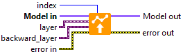

<h1>Bidirectional</h1>

<h2>Description</h2>

Defines the weights of the Bidirectional layer selected by the index. Type : <em><strong>polymorphic</strong><strong>.</strong></em>

<h3>Input parameters</h3>

<table>
  <tbody>
    <tr>
      <td width="64" valign="top"></td>
      <td valign="top"><strong>Model in : </strong>model architecture.</td>
    </tr>
    <tr>
      <td width="64" valign="top"></td>
      <td valign="top"><strong>index : <em>integer</em>, </strong>index of layer.</td>
    </tr>
    <tr>
      <td width="64" valign="top"></td>
      <td valign="top"><strong>layer : <em>variant, </em></strong>cluster from “<a href="../../../get-weight/index/get-gru-weights-by-index/README.md">gru_weights</a>” or “<a href="../../../get-weight/index/get-lstm-weights-by-index/README.md">lstm_weights</a>” or “<a href="../../../get-weight/index/get-simple-rnn-weights-by-index/README.md">simplernn_weights</a>“.</td>
    </tr>
    <tr>
      <td width="64" valign="top"></td>
      <td valign="top"><strong>backward_layer : <em>variant, </em></strong>cluster from “<a href="../../../get-weight/index/get-gru-weights-by-index/README.md">gru_weights</a>” or “<a href="../../../get-weight/index/get-lstm-weights-by-index/README.md">lstm_weights</a>” or “<a href="../../../get-weight/index/get-simple-rnn-weights-by-index/README.md">simplernn_weights</a>“.</td>
    </tr>
  </tbody>
</table>

<h3>Output parameters</h3>

<table>
  <tbody>
    <tr>
      <td width="64" valign="top"></td>
      <td valign="top"><strong>Model out : </strong>model architecture.</td>
    </tr>
  </tbody>
</table>

<h2>Example</h2>

All these exemples are snippets PNG, you can drop these Snippet onto the block diagram and get the depicted code added to your VI (Do not forget to install Deep Learning library to run it).

