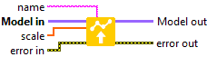

<h1>AdditiveAttention</h1>

<h2>Description</h2>

Defines the weight of the AdditiveAttention layer selected by the name. Type : <em><strong>polymorphic</strong><strong>.</strong></em>

<h3>Input parameters</h3>

<table>
  <tbody>
    <tr>
      <td width="64" valign="top"></td>
      <td valign="top"><strong>Model in : </strong>model architecture.</td>
    </tr>
    <tr>
      <td width="64" valign="top"></td>
      <td valign="top"><strong>name : <em>string</em>, </strong>name of layer.</td>
    </tr>
    <tr>
      <td width="64" valign="top"></td>
      <td valign="top"><strong>scale : <em>array, </em></strong>1D values. scale = query[2] = value[2] = key[2].</td>
    </tr>
  </tbody>
</table>

<h3>Output parameters</h3>

<table>
  <tbody>
    <tr>
      <td width="64" valign="top"></td>
      <td valign="top"><strong>Model out : </strong>model architecture.</td>
    </tr>
  </tbody>
</table>

<h2>Dimension</h2>

<ul>
<li>scale = query[2] = value[2] = key[2]</li>
</ul>

The size of scale depends on the size of the query, value and key entries in the <a href="../../../../architecture/layers/additive-attention-add-to-graph/README.md">AdditiveAttention</a> layer. For example, if query has a size of [batch_size = 5<strong>,</strong> Tq = 3, dim = 1], value a size of [batch_size = 10, Tv = 4, dim = 1] and key a size of [batch_size = 8, Tv = 6, dim = 1] then the size of scale is [dim = 1]. Another example, if query has a size of [batch_size = 10, Tq = 9, dim = 5], value a size of [batch_size = 15, Tv = 10, dim = 5] and key a size of [batch_size = 9, Tv = 7, dim = 5] then the size of scale is [dim = 5]. <strong><em>query, value and key will always have the same value at index 2 of their size, which will be the size of scale.</em></strong>

<h2>Example</h2>

All these exemples are snippets PNG, you can drop these Snippet onto the block diagram and get the depicted code added to your VI (Do not forget to install Deep Learning library to run it).

