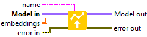

<h1>Embedding</h1>

<h2>Description</h2>

Defines the weight of the Embedding layer selected by the name. Type : <em><strong>polymorphic</strong><strong>.</strong></em>

<h3>Input parameters</h3>

<table>
  <tbody>
    <tr>
      <td width="64" valign="top"></td>
      <td valign="top"><strong>Model in : </strong>model architecture.</td>
    </tr>
    <tr>
      <td width="64" valign="top"></td>
      <td valign="top"><strong>name : <em>string</em>, </strong>name of layer.</td>
    </tr>
    <tr>
      <td width="64" valign="top"></td>
      <td valign="top"><strong>embeddings : <em>array, </em></strong>2D values. embeddings = [input_dim, output_dim].</td>
    </tr>
  </tbody>
</table>

<h3>Output parameters</h3>

<table>
  <tbody>
    <tr>
      <td width="64" valign="top"></td>
      <td valign="top"><strong>Model out : </strong>model architecture.</td>
    </tr>
  </tbody>
</table>

<h2>Dimension</h2>

<ul>
<li>embeddings = [input_dim, output_dim]</li>
</ul>

The size depends on the input_dim and output_dim parameters of the <a href="../../../../architecture/layers/embedding-add-to-graph/README.md">Embedding</a> layer. For example if the input_dim parameter has the value 5 and the output_dim parameter has the value 3 then the size of embeddings will be [input_dim = 5, output_dim = 3].

<h2>Example</h2>

All these exemples are snippets PNG, you can drop these Snippet onto the block diagram and get the depicted code added to your VI (Do not forget to install Deep Learning library to run it).

