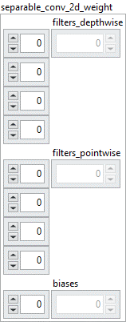

<h1>SeparableConv2D</h1>

<h2>Description</h2>

Defines the weights of the SeparableConv2D layer selected by the name. Type : <em><strong>polymorphic</strong><strong>.</strong></em>

<h3>Input parameters</h3>

<table>
  <tbody>
    <tr>
      <td width="64" valign="top"></td>
      <td valign="top"><strong>Model in : </strong>model architecture.</td>
    </tr>
    <tr>
      <td width="64" valign="top"></td>
      <td valign="top"><strong>name : <em>string</em>, </strong>name of layer.</td>
    </tr>
  </tbody>
</table>

<table>
  <tbody>
    <tr>
      <td valign="top" width="70%"><table>
  <tbody>
    <tr>
      <td width="64" valign="top"></td>
      <td valign="top"><strong>separable_conv_2d_weight : <em>cluster</em></strong></td>
    </tr>
    <tr>
      <td></td>
      <td valign="top"><table>
  <tbody>
    <tr>
      <td width="64" valign="top"></td>
      <td valign="top"><strong>filters_depthwise : <em>array, </em></strong>4D values. filters_depthwise = [channels, 1, size[0], size[1]].</td>
    </tr>
    <tr>
      <td width="64" valign="top"></td>
      <td valign="top"><strong>filters_pointwise : <em>array, </em></strong>4D values. filters_pointwise = [n_filters, channels, 1, 1].</td>
    </tr>
    <tr>
      <td width="64" valign="top"></td>
      <td valign="top"><strong>biases : <em>array, </em></strong>1D values. biases = [n_filters].</td>
    </tr>
  </tbody>
</table></td>
    </tr>
  </tbody>
</table></td>
      <td valign="top" width="30%">

</td>
    </tr>
  </tbody>
</table>

<h3>Output parameters</h3>

<table>
  <tbody>
    <tr>
      <td width="64" valign="top"></td>
      <td valign="top"><strong>Model out : </strong>model architecture.</td>
    </tr>
  </tbody>
</table>

<h2>Dimension</h2>

<ul>
<li>filters_depthwise = [channels, 1, size[0], size[1]]</li>
</ul>

The size of filters_depthwise depends on the input of the <a href="../../../../architecture/layers/separable-conv-2d-add-to-graph/README.md">SeparableConv2D</a> layer and the parameters size. For example if the input of the layer has a size of [batch_size = 10, channels = 5, rows = 2, cols = 2] and size the value [3, 3] then filters_depthwise will have a size of [channels = 5, 1, size[0] = 3, size[1] = 3].

<ul>
<li>filters_pointwise = [n_filters, channels, 1, 1]</li>
</ul>

The size of filters_pointwise depends on the input of the <a href="../../../../architecture/layers/separable-conv-2d-add-to-graph/README.md">SeparableConv2D</a> layer and the parameters n_filters. For example if the input of the layer has a size of [batch_size = 10, channels = 5, rows = 2, cols = 2] and n_filters has the value 6 then filters_pointwise will have a size of [n_filters = 6, channels = 5, 1, 1].

<ul>
<li>biases = [n_filters]</li>
</ul>

 The size of biases depends on the parameter n_filters of the <a href="../../../../architecture/layers/separable-conv-2d-add-to-graph/README.md">SeparableConv2D</a> layer.

<h2>Example</h2>

All these exemples are snippets PNG, you can drop these Snippet onto the block diagram and get the depicted code added to your VI (Do not forget to install Deep Learning library to run it).

