<h1>Resume</h1>

<table>
  <tbody>
    <tr>
      <td valign="top" width="62%">

</td>
      <td valign="top" width="38%">
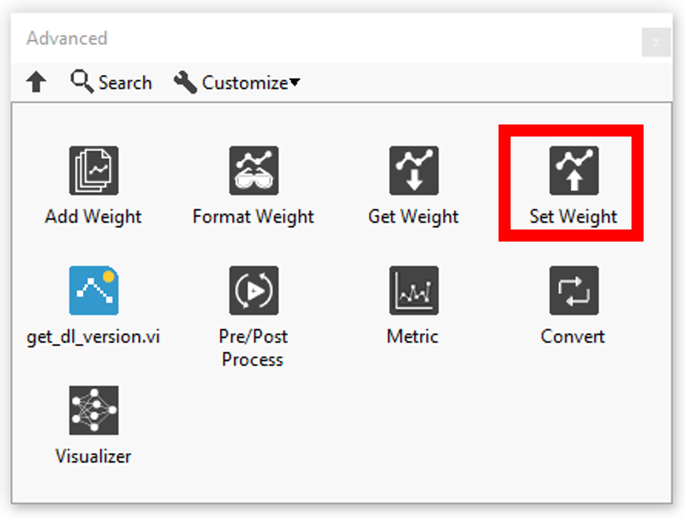
</td>
    </tr>
  </tbody>
</table>

<h2>SET WEIGHTS</h2>

In this section you will find a list for set the layer weight.

| ### INDEX |  |  |
| --- | --- | --- |
|  | **ICONS** | **RESUME** |
| [Dense](../index-set-weight/set-dense-weights-by-index/README.md) | 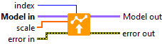 | Defines the weights of the Dense layer selected by the index. |
| [Embedding](../index-set-weight/set-embedding-weights-by-index/README.md) |  | Defines the weight of the Embedding layer selected by the index. |
| [AdditiveAttention](../index-set-weight/set-additive-attention-weights-by-index/README.md) | 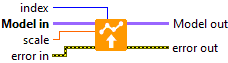 | Defines the weight of the AdditiveAttention layer selected by the index. |
| [Attention](../index-set-weight/set-attention-weights-by-index/README.md) |  | Defines the weight of the Attention layer selected by the index. |
| [MultiHeadAttention](../index-set-weight/set-multi-head-attention-weights-by-index/README.md) | 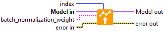 | Defines the weights of the MultiHeadAttention layer selected by the index. |
| [Conv1D](../index-set-weight/set-conv-1d-weights-by-index/README.md) | 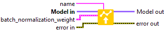 | Defines the weights of the Conv1D layer selected by the index. |
| [Conv2D](../index-set-weight/set-conv-2d-weights-by-index/README.md) |  | Defines the weights of the Conv2D layer selected by the index. |
| [Conv3D](../index-set-weight/set-conv-3d-weights-by-index/README.md) |  | Defines the weights of the Conv3D layer selected by the index. |
| [ConvLSTM1D](../index-set-weight/set-conv-lstm-1d-weights-by-index/README.md) |  | Defines the weights of the ConvLSTM1D layer selected by the index. |
| [ConvLSTM2D](../index-set-weight/set-conv-lstm-2d-weights-by-index/README.md) |  | Defines the weights of the ConvLSTM2D layer selected by the index. |
| [ConvLSTM3D](../index-set-weight/set-conv-lstm-3d-weights-by-index/README.md) |  | Defines the weights of the ConvLSTM3D layer selected by the index. |
| [Conv1DTranspose](../index-set-weight/set-conv-1d-transpose-weights-by-index/README.md) |  | Defines the weights of the Conv1DTranspose layer selected by the index. |
| [Conv2DTranspose](../index-set-weight/set-conv-2d-transpose-weights-by-index/README.md) |  | Defines the weights of the Conv2DTranspose layer selected by the index. |
| [Conv3DTranspose](../index-set-weight/set-conv-3d-transpose-weights-by-index/README.md) |  | Defines the weights of the Conv3DTranspose layer selected by the index. |
| [DepthwiseConv2D](../index-set-weight/set-depthwise-conv-2d-weights-by-index/README.md) |  | Defines the weights of the DepthwiseConv2D layer selected by the index. |
| [SeparableConv1D](../index-set-weight/set-separable-conv-1d-weights-by-index/README.md) |  | Defines the weights of the SeparableConv1D layer selected by the index. |
| [SeparableConv2D](../index-set-weight/set-separable-conv-2d-weights-by-index/README.md) |  | Defines the weights of the SeparableConv2D layer selected by the index. |
| [BatchNormalization](../index-set-weight/set-batch-norm-weights-by-index/README.md) | 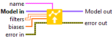 | Defines the weights of the BatchNormalization layer selected by the index. |
| [LayerNormalization](../index-set-weight/set-layer-norm-weights-by-index/README.md) | 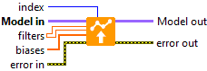 | Defines the weights of the LayerNormalization layer selected by the index. |
| [PReLU 2D](../index-set-weight/set-prelu-2d-weights-by-index/README.md) |  | Defines the weight of the PReLU2D layer selected by the index. |
| [PReLU 3D](../index-set-weight/set-prelu-3d-weights-by-index/README.md) |  | Defines the weight of the PReLU3D layer selected by the index. |
| [PReLU 4D](../index-set-weight/set-prelu-4d-weights-by-index/README.md) | 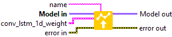 | Defines the weight of the PReLU4D layer selected by the index. |
| [PReLU 5D](../index-set-weight/set-prelu-5d-weights-by-index/README.md) | 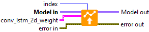 | Defines the weight of the PReLU5D layer selected by the index. |
| [Bidirectional](../index-set-weight/set-bidirectional-weights-by-index/README.md) |  | Defines the weights of the Bidirectional layer selected by the index. |
| [GRU](../index-set-weight/set-gru-weights-by-index/README.md) | 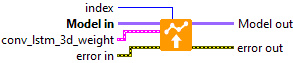 | Defines the weights of the GRU layer selected by the index. |
| [LSTM](../index-set-weight/set-lstm-weights-by-index/README.md) |  | Defines the weights of the LSTM layer selected by the index. |
| [RNN (GRU)](../index-set-weight/set-rnn-gru-weights-by-index/README.md) | 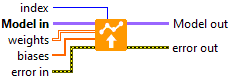 | Defines the weights of the RNN layer selected by the index. |
| [RNN (LSTM)](../index-set-weight/set-rnn-lstm-weights-by-index/README.md) |  | Defines the weights of the RNN layer selected by the index. |
| [RNN (SimpleRNN)](../index-set-weight/set-rnn-simple-rnn-weights-by-index/README.md) | 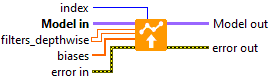 | Defines the weights of the RNN layer selected by the index. |
| [SimpleRNN](../index-set-weight/set-simple-rnn-weights-by-index/README.md) | 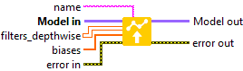 | Defines the weights of the SimpleRNN layer selected by the index. |
| ### NAME |  |  |
|  | **ICONS** | **RESUME** |
| [Dense](../name-set-weight/set-dense-weights-by-name/README.md) | 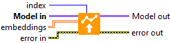 | Defines the weights of the Dense layer selected by the name. |
| [Embedding](../name-set-weight/set-embedding-weights-by-name/README.md) |  | Defines the weight of the Embedding layer selected by the name. |
| [AdditiveAttention](../name-set-weight/set-additive-attention-weights-by-name/README.md) | 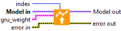 | Defines the weight of the AdditiveAttention layer selected by the name. |
| [Attention](../name-set-weight/set-attention-weights-by-name/README.md) | 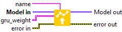 | Defines the weight of the Attention layer selected by the name. |
| [MultiHeadAttention](../name-set-weight/set-multi-head-attention-weights-by-name/README.md) | 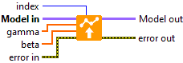 | Defines the weights of the MultiHeadAttention layer selected by the name. |
| [Conv1D](../name-set-weight/set-conv-1d-weights-by-name/README.md) | 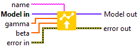 | Defines the weights of the Conv1D layer selected by the name. |
| [Conv2D](../name-set-weight/set-conv-2d-weights-by-name/README.md) | 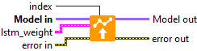 | Defines the weights of the Conv2D layer selected by the name. |
| [Conv3D](../name-set-weight/set-conv-3d-weights-by-name/README.md) |  | Defines the weights of the Conv3D layer selected by the name. |
| [ConvLSTM1D](../name-set-weight/set-conv-lstm-1d-weights-by-name/README.md) | 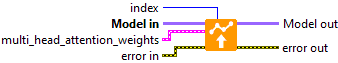 | Defines the weights of the ConvLSTM1D layer selected by the name. |
| [ConvLSTM2D](../name-set-weight/set-conv-lstm-2d-weights-by-name/README.md) |  | Defines the weights of the ConvLSTM2D layer selected by the name. |
| [ConvLSTM3D](../name-set-weight/set-conv-lstm-3d-weights-by-name/README.md) |  | Defines the weights of the ConvLSTM3D layer selected by the name. |
| [Conv1DTranspose](../name-set-weight/set-conv-1d-transpose-weights-by-name/README.md) | 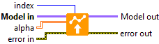 | Defines the weights of the Conv1DTranspose layer selected by the name. |
| [Conv2DTranspose](../name-set-weight/set-conv-2d-transpose-weights-by-name/README.md) | 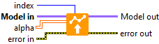 | Defines the weights of the Conv2DTranspose layer selected by the name. |
| [Conv3DTranspose](../name-set-weight/set-conv-3d-transpose-weights-by-name/README.md) |  | Defines the weights of the Conv3DTranspose layer selected by the name. |
| [DepthwiseConv2D](../name-set-weight/set-depthwise-conv-2d-weights-by-name/README.md) | 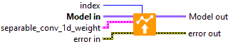 | Defines the weights of the DepthwiseConv2D layer selected by the name. |
| [SeparableConv1D](../name-set-weight/set-separable-conv-1d-weights-by-name/README.md) | 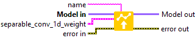 | Defines the weights of the SeparableConv1D layer selected by the name. |
| [SeparableConv2D](../name-set-weight/set-separable-conv-2d-weights-by-name/README.md) |  | Defines the weights of the SeparableConv2D layer selected by the name. |
| [BatchNormalization](../name-set-weight/set-batch-norm-weights-by-name/README.md) |  | Defines the weights of the BatchNormalization layer selected by the name. |
| [LayerNormalization](../name-set-weight/set-layer-norm-weights-by-name/README.md) |  | Defines the weights of the LayerNormalization layer selected by the name. |
| [PReLU 2D](../name-set-weight/set-prelu-2d-weights-by-name/README.md) | 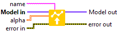 | Defines the weight of the PReLU2D layer selected by the name. |
| [PReLU 3D](../name-set-weight/set-prelu-3d-weights-by-name/README.md) | 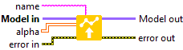 | Defines the weight of the PReLU3D layer selected by the name. |
| [PReLU 4D](../name-set-weight/set-prelu-4d-weights-by-name/README.md) | 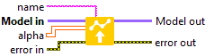 | Defines the weight of the PReLU4D layer selected by the name. |
| [PReLU 5D](../name-set-weight/set-prelu-5d-weights-by-name/README.md) | 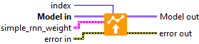 | Defines the weight of the PReLU5D layer selected by the name. |
| [Bidirectional](../name-set-weight/set-bidirectional-weights-by-name/README.md) |  | Defines the weights of the Bidirectional layer selected by the name. |
| [GRU](../name-set-weight/set-gru-weights-by-name/README.md) |  | Defines the weights of the GRU layer selected by the name. |
| [LSTM](../name-set-weight/set-lstm-weights-by-name/README.md) |  | Defines the weights of the LSTM layer selected by the name. |
| [RNN (GRU)](../name-set-weight/set-rnn-gru-weights-by-name/README.md) |  | Defines the weights of the RNN layer selected by the name. |
| [RNN (LSTM)](../name-set-weight/set-rnn-lstm-weights-by-name/README.md) |  | Defines the weights of the RNN layer selected by the name. |
| [RNN (SimpleRNN)](../name-set-weight/set-rnn-simple-rnn-weights-by-name/README.md) |  | Defines the weights of the RNN layer selected by the name. |
| [SimpleRNN](../name-set-weight/set-simple-rnn-weights-by-name/README.md) |  | Defines the weights of the SimpleRNN layer selected by the name. |
