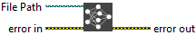

<h1>Visualizer</h1>

<h2>Description</h2>

Open Netron visualization of the given file.

Netron is an open-source tool that allows you to visualize and explore machine learning and deep learning models. It supports a wide range of popular model file formats, including :

<ul>
<li>
<ul>
<li>

ONNX (.onnx)

</li>
<li>

TensorFlow (.pb, .savedmodel)

</li>
<li>

Keras (.h5)

</li>
<li>

PyTorch (.pth, .pt)

</li>
<li>

Caffe (.prototxt)

</li>
<li>

CoreML (.mlmodel)

</li>
<li>

Darknet (.cfg, .weights)

</li>
<li>

MXNet (.json, .params)

</li>
<li>

TorchScript (.pt)

</li>
<li>

TensorFlow Lite (.tflite)

</li>
</ul>
</li>
</ul>

Netron displays these files as graphs, making it easier to inspect the structure of neural networks, including nodes, inputs, outputs, and the operations used in the model. This is particularly useful for debugging, analyzing, and optimizing machine learning models.

<h3></h3>

<h3>Input parameters</h3>

<table>
  <tbody>
    <tr>
      <td width="64" valign="top"></td>
      <td valign="top"><strong>File Path : <em>path, </em></strong>is the path of model file.</td>
    </tr>
  </tbody>
</table>

<h2>Example</h2>

All these exemples are snippets PNG, you can drop these Snippet onto the block diagram and get the depicted code added to your VI (Do not forget to install Deep Learning library to run it).

