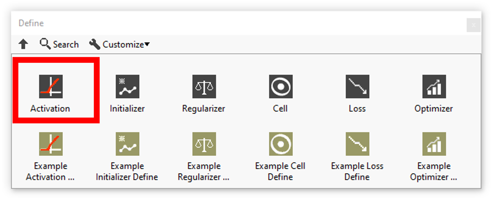

<h1>Activations resume</h1>

<table>
  <tbody>
    <tr>
      <td valign="top" width="50%">

</td>
      <td valign="top" width="50%">

</td>
    </tr>
  </tbody>
</table>

In this section you’ll find a list of all define activations available (to use for the TimeDitributed layer). 

|  | **ICONS** | **RESUME** |
| --- | --- | --- |
| [ELU](https://haibal.com/documentation/elu-define/) |  | Define the elu layer according to its parameters. |
| [Exponential](https://haibal.com/documentation/exponential-define/) |  | Define the exponential layer according to its parameters. |
| [GELU](../../../layers/gelu-add-to-graph/README.md) |  | Define the gelu layer according to its parameters. |
| [HardSigmoid](https://haibal.com/documentation/hard-sigmoid-define/) |  | Define the hard sigmoid layer according to its parameters. |
| [LeakyReLU](https://haibal.com/documentation/leaky-relu-define/) |  | Define the leaky relu layer according to its parameters. |
| [Linear](https://haibal.com/documentation/linear-define/) |  | Define the linear layer according to its parameters. |
| [ReLU](https://haibal.com/documentation/relu-define/) |  | Define the relu layer according to its parameters. |
| [SELU](https://haibal.com/documentation/selu-define/) |  | Define the selu layer according to its parameters. |
| [Sigmoid](https://haibal.com/documentation/sigmoid-define/) |  | Define the sigmoid layer according to its parameters. |
| [SoftMax](https://haibal.com/documentation/softmax-define/) |  | Define the softmax layer according to its parameters. |
| [SoftPlus](https://haibal.com/documentation/softplus-define/) |  | Define the softplus layer according to its parameters. |
| [SoftSign](https://haibal.com/documentation/softsign-define/) |  | Define the softsign layer according to its parameters. |
| [Swish](https://haibal.com/documentation/swish-define/) |  | Define the swish layer according to its parameters. |
| [TanH](https://haibal.com/documentation/tanh-define/) |  | Define the tanh layer according to its parameters. |
| [ThresholdedReLU](https://haibal.com/documentation/thresholded-relu-define/) |  | Define the thresholded relu layer according to its parameters. |
