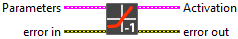
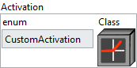
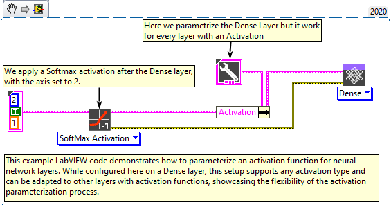

<h1>Sigmoid</h1>

<h2>Description</h2>

Define the sigmoid layer according to its parameters. Type : <em><strong>polymorphic</strong></em>.

<h3>Input parameters</h3>

<table>
  <tbody>
    <tr>
      <td valign="top" width="75%">
<strong>Parameters :</strong> layer parameters.

<table>
  <tbody>
    <tr>
      <td width="64" valign="top"></td>
      <td valign="top"><strong>training? :</strong> <em><strong>boolean</strong></em>, whether the layer is in training mode (can store data for backward).</td>
    </tr>
    <tr>
      <td width="64" valign="top"></td>
      <td valign="top">Default value “True”.</td>
    </tr>
    <tr>
      <td width="64" valign="top"></td>
      <td valign="top"><strong>lda coeff :</strong> <em><strong>float</strong></em>, defines the coefficient by which the loss derivative will be multiplied before being sent to the previous layer (since during the backward run we go backwards).</td>
    </tr>
    <tr>
      <td width="64" valign="top"></td>
      <td valign="top">Default value “1”.</td>
    </tr>
  </tbody>
</table></td>
      <td valign="top" width="25%">

</td>
    </tr>
  </tbody>
</table>

<h3>Output parameters</h3>

<table>
  <tbody>
    <tr>
      <td valign="top" width="75%"><table>
  <tbody>
    <tr>
      <td width="64" valign="top"></td>
      <td valign="top"><strong>Activation :</strong> <em><strong>cluster,</strong></em> this cluster defines the activation function to be used in the model.</td>
    </tr>
    <tr>
      <td></td>
      <td valign="top"><table>
  <tbody>
    <tr>
      <td width="64" valign="top"></td>
      <td valign="top"><strong><a href="../../../../more-deep-learning/layers-parameters/activation/README.md">enum</a> :</strong> <em><strong>enum</strong></em>, an enumeration specifying the type of activation (e.g., ReLU, Sigmoid, etc.). If <code>enum</code> is set to <code>CustomActivation</code>, the custom class on the right will be used as the activation function. Otherwise, the selected activation from the enum will be used with its default parameters.</td>
    </tr>
    <tr>
      <td width="64" valign="top"></td>
      <td valign="top"><strong>Class :</strong> <em><strong>object</strong></em>, a custom activation class instance.</td>
    </tr>
  </tbody>
</table></td>
    </tr>
  </tbody>
</table></td>
      <td valign="top" width="25%">

</td>
    </tr>
  </tbody>
</table>

<h2>Example</h2>

All these exemples are snippets PNG, you can drop these Snippet onto the block diagram and get the depicted code added to your VI (Do not forget to install Deep Learning library to run it).

